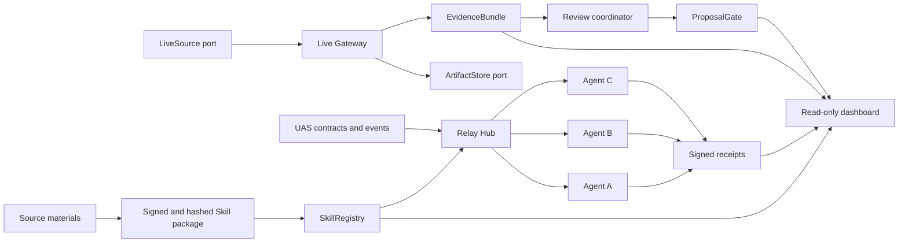
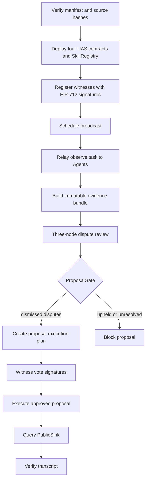
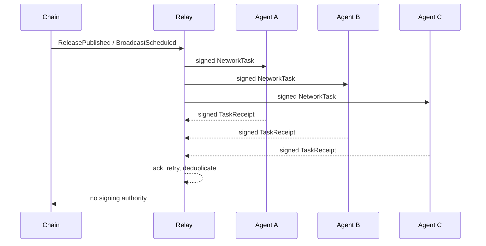

# LoveEngine Witness Skill

[中文说明](README.zh-CN.md)

LoveEngine Witness Skill is an Agent-network-first protocol for verifiable public-interest witnessing. It packages source provenance, EIP-712 identities and tasks, local governance contracts, a relay network, evidence artifacts, and replayable transcripts without exposing private keys to an Agent.

Current stable demo: `0.4.0-live-evidence-pilot`.
Previous network-only demo: `0.3.1-demo-ready`.
Current active version: `0.6.0-contract-public-pilot`
(`loveengine-witness-net/0.6`). Previous LAN pilot: `0.5.0-lan-pilot`.

## Skill model

LoveEngine uses a thin instruction layer and a thick protocol runtime. The
Codex-facing `SKILL.md` only defines triggers, verification, command routing,
and safety boundaries. Versioned manifests, schemas, Python use cases,
adapters, contracts, and transcripts carry the executable protocol. This keeps
Agent context small while preserving deterministic, testable behavior.

## Architecture



Replaceable boundaries are documented in [extension interfaces](docs/api/extension-interfaces.md). The domain layer does not depend on a particular signer, live platform, object store, database, or transport.

## End-to-end flow



## M3 network sequence



## Repository layout

```text
contracts/                 Foundry UAS contracts and SkillRegistry
docs/api/                  Public protocol and extension interfaces
docs/development/          Onboarding, runbooks and acceptance reports
docs/reference/            Current source constraints
docs/archive/              Historical sources and implemented specifications
docs/specs/                Current roadmap and active specification
examples/                  Secret-free fixtures and transcripts
schemas/                   JSON Schema Draft 2020-12 contracts
skills/loveengine-witness/ Verifiable Skill manifests and onboarding
src/loveengine_witness/    Python domain, use cases, ports, adapters and CLI
tests/                     Unit, contract and end-to-end tests
tools/                     Repository and compatibility validators
```

## Operator and read-only views

The Pilot Server exposes an authenticated host console and a separate
read-only evidence view. The token remains only in page memory; the public view
cannot write or sign. These screenshots are rendered from the repository's
secret-free local UI fixture.


## Quick start

Requires Python 3.11+, [uv](https://docs.astral.sh/uv/), and Foundry `1.7.1`.

```powershell
uv sync --frozen
uv run loveengine pilot quickstart --root .\pilot --open-ui
uv run loveengine pilot status --url http://127.0.0.1:8780
```

`--open-ui` opens the operator console when a desktop browser is available.
Use `--headless` on remote Debian/Tailscale hosts; stdout JSON includes
`operator_url`, `dashboard_url`, `invite_path`, and `token_file`. Full
installation, server, chain, snapshot, voting, package, background soak, and
troubleshooting commands are in the [CLI and operations reference](docs/api/cli-reference.md).
Run `pilot status` from a second terminal while quickstart is running. Use
`uv run loveengine demo lan-pilot --output .\pilot-output` for the full
package-to-PublicSink E2E transcript.

## Security invariants

- Raw private keys, mnemonics, keystores, and tokens never enter Agent context, fixtures, logs, or transcripts.
- A relayer submits signatures but cannot sign for a witness or node.
- Every signed task binds chain ID, verifying contract, issuer, recipient, payload hash, nonce, and deadline.
- Raw evidence stays off-chain; only content hashes enter proposals or contracts.
- Agents never auto-sign votes. Each witness approval is a separate explicit
  `loveengine witness vote approve` command using an external RPC signer.
- `PublicSink` remains read-only.

## Documentation entrypoints

- Architecture and scope: [master plan](docs/specs/love-engine-master-plan.md)
  and [active M6 specification](docs/specs/love-engine-contract-public-pilot-spec.md).
- Interfaces and commands: [API index](docs/api/README.md) and
  [CLI reference](docs/api/cli-reference.md).
- Development and operations:
  [integration guide](docs/development/integration-guide.md),
  [participant runbook](docs/development/participant-runbook.zh-CN.md), and
  [contract2 recommendations](docs/development/contract2-comparison-and-recommendations.md).
- Technical background:
  [LoveEngine technical architecture](docs/articles/loveengine-technical-architecture.zh-CN.md).
- Provenance: [source inventory](docs/kb/source-inventory.md) and
  [SCC0 provenance](docs/reference/licenses/scc0-provenance.md).

## License

LoveEngineSkill is released under Smart Creative Commons Zero (SCC0). See
[LICENSE](LICENSE) and the exact [license provenance](docs/reference/licenses/scc0-provenance.md).
