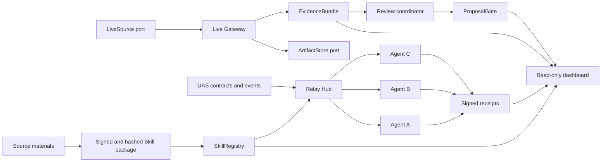
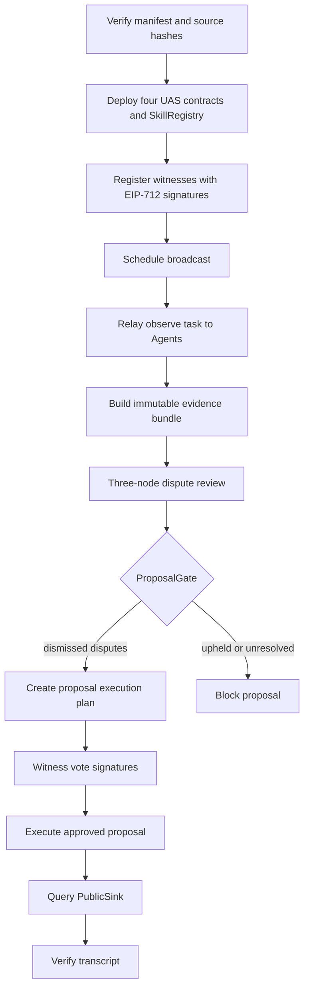
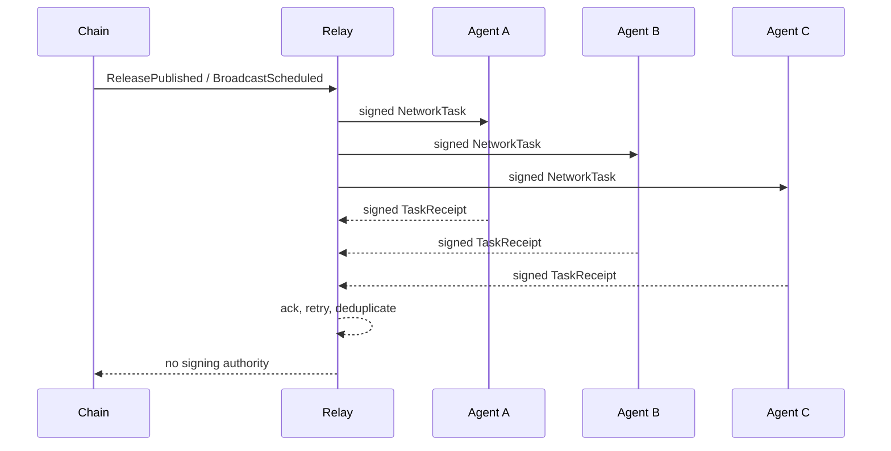

# LoveEngine Witness Skill

[中文说明](README.zh-CN.md)

LoveEngine Witness Skill is an Agent-network-first protocol for verifiable public-interest witnessing. It packages source provenance, EIP-712 identities and tasks, local governance contracts, a relay network, evidence artifacts, and replayable transcripts without exposing private keys to an Agent.

Current stable demo: `0.3.1-demo-ready`.
Active development target: `0.4.0-live-evidence-pilot`.

## Architecture



Replaceable boundaries are documented in [extension interfaces](docs/api/extension-interfaces.md). The domain layer does not depend on a particular signer, live platform, object store, database, or transport.

## End-to-end flow



## M3 network sequence



## Repository layout

```text
contracts/                 Foundry UAS contracts and SkillRegistry
docs/api/                  Public protocol and extension interfaces
docs/development/          Onboarding, runbooks and acceptance reports
docs/reference/            Current source constraints
docs/archive/              Historical sources and implemented specifications
docs/specs/                Current roadmap and active specification
examples/                  Secret-free fixtures and transcripts
schemas/                   JSON Schema Draft 2020-12 contracts
skills/loveengine-witness/ Verifiable Skill manifests and onboarding
src/loveengine_witness/    Python domain, use cases, ports, adapters and CLI
tests/                     Unit, contract and end-to-end tests
tools/                     Repository and compatibility validators
```

## Requirements

- Python 3.11 or newer
- [uv](https://docs.astral.sh/uv/)
- Foundry `1.7.1` for contract and Anvil demos

```powershell
uv sync --frozen
cd contracts
forge install foundry-rs/forge-std@v1.9.7 --no-git
forge install OpenZeppelin/openzeppelin-contracts@v5.3.0 --no-git
cd ..
```

## Verification

```powershell
uv run python .\tools\check.py
uv run pytest -m "not integration" -q

cd contracts
forge test
cd ..

uv run pytest .\tests\test_demo.py
uv run pytest .\tests\integration\test_network_demo.py
```

## Run the demos

```powershell
uv run loveengine manifest verify

uv run loveengine demo local-loop --output .\examples\transcripts
uv run loveengine transcript verify .\examples\transcripts\local-loop.fixture.json

uv run loveengine network demo --nodes 3 --output .\examples\transcripts
uv run loveengine network transcript verify .\examples\transcripts\network-pilot.fixture.json

uv run loveengine demo live-evidence --nodes 3 --input .\examples\live\live-session.fixture.ndjson --output .\examples\transcripts
uv run loveengine live transcript verify .\examples\transcripts\live-review.fixture.json
```

The M3 presentation sequence is in [demo runbook](docs/development/m3-demo-runbook.md). Verified release evidence is in [acceptance report](docs/development/m3-acceptance-report.md).

## CLI groups

```text
manifest  node  fixture  evidence  transcript
eip712    relayer  registry  bootstrap
relay     network  live  dispute  review
proposal  demo
```

All successful commands emit JSON to stdout. Structured errors use stderr and stable error codes.

## Security invariants

- Raw private keys, mnemonics, keystores, and tokens never enter Agent context, fixtures, logs, or transcripts.
- A relayer submits signatures but cannot sign for a witness or node.
- Every signed task binds chain ID, verifying contract, issuer, recipient, payload hash, nonce, and deadline.
- Raw evidence stays off-chain; only content hashes enter proposals or contracts.
- M4 review tasks never request or produce vote signatures.
- `PublicSink` remains read-only.

## Documentation order

1. [Master plan](docs/specs/love-engine-master-plan.md)
2. [Active M4 specification](docs/specs/love-engine-live-evidence-pilot-spec.md)
3. [API index](docs/api/README.md)
4. [Integration guide](docs/development/integration-guide.md)
5. [Source inventory](docs/kb/source-inventory.md)

## License

No repository-wide open-source license has been selected. Do not infer a license from archived SCC0 or DAism materials.
