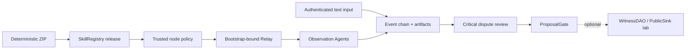

# LoveEngine Witness Skill

[中文说明](README.zh-CN.md)

This repository implements one Skill: loveengine-witness. It is the first
verifiable vertical slice of the LoveEngine/UAS layer in the wider
NaturalDAO/Proof of Love vision.

The Skill verifies a published package, receives observation tasks through an
Agent network, preserves public statements as content-addressed evidence,
coordinates dispute review, and prepares a ProposalGate result. Agents do not
act, vote, or decide real-world truth for people.

## Status

The latest Git tag is v0.6.0-contract-public-pilot. The working target
0.6.1-contract-public-pilot is a candidate, not a published release. The wire
protocol remains loveengine-witness-net/0.6 so M0-M6 schemas and historical
transcripts remain verifiable.

| Area | Status |
| --- | --- |
| Package/Registry trust, signed task/receipt, evidence and dispute review | Implemented locally |
| ProposalGate and verifiable core transcript | Implemented locally |
| WitnessDAO, explicit votes and PublicSink | Optional governance experiment |
| Shared Linux preflight and key-only remote lab tooling | Implemented; short ARM64 Linux acceptance passed |
| Company livestream adapter and autonomous discovery | Not implemented |
| Direct Tailscale/public/testnet service, production identity, TLS and HA | Not completed |

The local tests and the 2026-07-27 shared ARM64 Linux short acceptance of
candidate baseline `2fd3a29` demonstrate protocol separation, tamper detection,
cross-platform repeatability, and the public-node SSH tunnel path. They do not
demonstrate independent real-world organizations, statement truth, public
deployment, or long-term artifact availability.

## Core Flow



The default path stops at ProposalGate. The governance contracts remain useful
for experiments, but they are not the Witness Skill's core completion criterion.
ProposalGate is an off-chain advisory check, not WitnessDAO access control.

The invite tells a node where to connect. A separate NodeTrustPolicyV1, obtained
through a trusted side channel, fixes chain ID, Registry, Publisher,
skill/version, ZIP hash, manifest hash, and allowed issuers. A node does not
treat values reported by the invite, Relay, or task as trust anchors.

## Local Experiment

Requirements: Python 3.11+, uv, and pinned Foundry 1.7.1.

```powershell
uv sync --frozen
uv run loveengine manifest verify
uv run loveengine pilot contracts prepare
uv run loveengine demo lan-pilot --stage core --events 12 --observers 10 --output .\pilot-output
```

`pilot contracts prepare` is an explicit prerequisite for real local Pilot
work. It verifies both Forge and Anvil are exactly `1.7.1`, verifies the
versioned `contracts/dependency-lock.json`, runs `forge build --threads 1`,
and emits an artifact/source/dependency attestation. A missing public
dependency is materialized only by a controlled Git checkout of its full
pinned commit from an allowlisted HTTPS repository. Its small, versioned
submodule graph is checked for path, URL, and gitlink before each direct
checkout; deeper declarations fail closed. The final locked tree digest is
then checked. A present but mismatching tree fails closed until an operator
explicitly runs
`pilot contracts prepare --refresh-dependencies`. That refresh stages and
verifies the replacement before switching the named managed directory. The
command canonicalizes managed UTF-8 dependency text to LF before compiling and
writes only ignored `contracts/lib`, `contracts/out`, and
`contracts/cache` work products. `package build`, `quickstart`, `lan-pilot`,
and `pilot soak` deliberately fail
closed with this command when those artifacts are absent; they do not compile
or download dependencies during a timed experiment.

The core experiment builds and anchors a real ZIP, starts a local Anvil and
Relay, uses the public node CLI, verifies artifacts, resolves a fixed dispute,
evaluates ProposalGate, and writes WitnessCoreTranscriptV1. Its output marks
environment: local_anvil and actors_simulated: true.

The review nodes do not sign a verdict from a lookup table alone. Before
signing, each node retrieves the finalized bundle, event list, and
content-addressed artifacts from the invite-bound HTTP origin and independently
recomputes the event chain and bundle references.

The cross-platform core runner performs the same explicit preparation as its
first recorded stage and includes the resulting provenance in its machine
report:

```powershell
uv run python .\tools\run_core_experiments.py
```

Run the optional governance extension separately:

```powershell
uv run loveengine demo lan-pilot --stage governance --events 12 --observers 10 --output .\governance-output
```

Start the loopback-only interactive server:

```powershell
uv run loveengine pilot quickstart --root .\pilot --headless
```

Quickstart writes both pilot-invite.json and pilot-trust-policy.json. It is not a
remote deployment command. A dry run prints the plan without creating runtime
state:

```powershell
uv run loveengine pilot quickstart --root .\pilot --dry-run --headless
```

## Shared Remote Lab

The pre-enterprise remote lab keeps Pilot and Anvil on the remote loopback
interface. It pins the SSH host key, requires public-key authentication, runs a
read-only resource gate, deploys one clean commit to a unique directory, limits
the experiment to two CPUs with lower scheduling priority, and downloads the
report/transcript for another local offline verification. Run mode also maps
the remote loopback through an SSH tunnel and proves that the public node CLI
starts three authenticated processes before task submission; each receives its
own post-connection task, verifies retrievable finalized evidence, and returns
an individually bound receipt.

```powershell
uv run python .\tools\run_remote_lab.py preflight --host <host> --user <user> --identity-file <ssh-key> --known-hosts .\tmp\remote-known-hosts
uv run python .\tools\run_remote_lab.py run --host <host> --user <user> --identity-file <ssh-key> --known-hosts .\tmp\remote-known-hosts
```

The remote runner deliberately has no password option and does not use sudo,
systemd, public binds, or automatic cleanup. See the
[shared-host runbook](docs/development/runbooks/remote-lab-flow.zh-CN.md).
Success and failure both produce a machine-readable report. The final
postflight records whether process inspection succeeded and no lab process
remained; one-minute load can still reflect the experiment that just ended.

The latest accepted short cross-host run used merged commit
`76b7163fc2a72c503db6a1b34fd2670b5b9ab580`. It produced three observation
receipts, three review receipts, Gate ready, and passing recovery checks. The
downloaded transcript verified as `offline_integrity` with `trust_bound:false`;
the tunnel started three public node CLI processes, each received a
post-connection evidence-verified task and returned its own bound receipt.
Relay recorded `acked:3` and `receipt_confirmed:3`, and the post-run read-only
gate found no related process left behind. These are simulated profiles and
processes, not proof of socially independent witnesses. A foreground 30-minute
local core soak has passed; remote 30-minute and all four-hour soak evidence
remain deferred.

## Roles

| Role | Authority |
| --- | --- |
| Operator | Authenticated session/event writes, close, and explicit evidence finalization |
| Observation Agent | Release/task/evidence verification and signed receipts; never votes |
| Voting Witness | Optional governance lab only; explicitly approves through an external RPC signer |
| Viewer | Read-only session/evidence view; UI is not a trust root |
| Publisher | Builds packages, prepares an unsigned publish plan, and performs read-only Registry verification |

## Safety Boundaries

- Raw private keys, mnemonics, keystores, and write tokens never enter Agent
  context, tasks, fixtures, snapshots, logs, or transcripts.
- Events and artifacts are content-addressed. Finalization rereads the artifact
  bytes; GET endpoints never finalize or mutate evidence.
- Relay accepts bootstrap members only and binds each receipt to its
  authenticated WebSocket node and accepted pending task.
- Public task submission is idempotent only for byte-identical signed tasks.
  Nodes durably bind task ID and issuer nonce, persist receipts before sending,
  and use bounded reconnect plus a Relay-confirmed receipt handshake to recover
  an ACK-loss window without executing the task twice.
- One observation execution is capped at 10,000 new events and 64 MiB of
  artifacts; one review is capped at 1,000 events and 32 MiB. Each artifact is
  capped at 8 MiB.
- Offline integrity is not chain trust. A verifier reports trust_bound: true
  only when RPC facts also match an externally supplied trust policy.
- The Windows quickstart does not configure or verify an explicit NTFS ACL for
  its token file; this is loopback experiment isolation, not a production
  multi-user host boundary.
- Raw evidence stays off chain. PublicSink is read-only, and UTO is public
  accounting rather than a tradable asset.
- Remote lab automation requires a pinned host key and dedicated SSH public key;
  passwords are never accepted by the runner.

## Documentation

- [Meeting questions and evidence-backed answers](QA.md)
- [Core architecture and data flow](docs/architecture/witness-core-and-data-flow.zh-CN.md)
- [Developer experiments](docs/development/integration-guide.md)
- [CLI reference](docs/api/cli-reference.md)
- [Contract API](docs/api/loveengine-contract-api.md)
- [Engineering master plan](docs/specs/love-engine-master-plan.md)
- [Active remote lab specification](docs/specs/love-engine-pre-enterprise-remote-lab.md)
- [Shared-host runbook](docs/development/runbooks/remote-lab-flow.zh-CN.md)
- [Documentation index](docs/README.md)

## License

LoveEngineSkill is released under Smart Creative Commons Zero (SCC0). See
[LICENSE](LICENSE) and
[license provenance](docs/reference/licenses/scc0-provenance.md).
