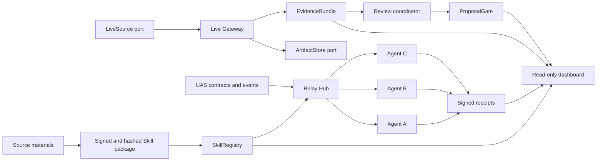
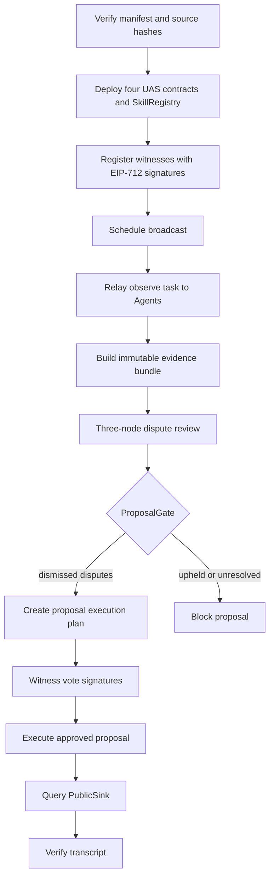
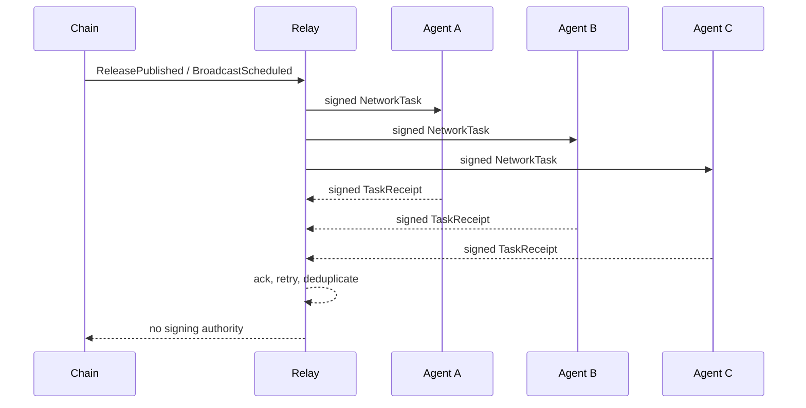

# LoveEngine Witness Skill

[中文说明](README.zh-CN.md)

LoveEngine Witness Skill is an Agent-network-first protocol for verifiable public-interest witnessing. It packages source provenance, EIP-712 identities and tasks, local governance contracts, a relay network, evidence artifacts, and replayable transcripts without exposing private keys to an Agent.

Current stable demo: `0.4.0-live-evidence-pilot`.
Previous network-only demo: `0.3.1-demo-ready`.
Current release candidate: `0.5.0-lan-pilot` (`loveengine-witness-net/0.5`).

## Skill model

LoveEngine uses a thin instruction layer and a thick protocol runtime. The
Codex-facing `SKILL.md` only defines triggers, verification, command routing,
and safety boundaries. Versioned manifests, schemas, Python use cases,
adapters, contracts, and transcripts carry the executable protocol. This keeps
Agent context small while preserving deterministic, testable behavior.

## Architecture



Replaceable boundaries are documented in [extension interfaces](docs/api/extension-interfaces.md). The domain layer does not depend on a particular signer, live platform, object store, database, or transport.

## End-to-end flow



## M3 network sequence



## Repository layout

```text
contracts/                 Foundry UAS contracts and SkillRegistry
docs/api/                  Public protocol and extension interfaces
docs/development/          Onboarding, runbooks and acceptance reports
docs/reference/            Current source constraints
docs/archive/              Historical sources and implemented specifications
docs/specs/                Current roadmap and active specification
examples/                  Secret-free fixtures and transcripts
schemas/                   JSON Schema Draft 2020-12 contracts
skills/loveengine-witness/ Verifiable Skill manifests and onboarding
src/loveengine_witness/    Python domain, use cases, ports, adapters and CLI
tests/                     Unit, contract and end-to-end tests
tools/                     Repository and compatibility validators
```

## Requirements

- Python 3.11 or newer
- [uv](https://docs.astral.sh/uv/)
- Foundry `1.7.1` for contract and Anvil demos

```powershell
uv sync --frozen
cd contracts
forge install foundry-rs/forge-std@v1.9.7 --no-git
forge install OpenZeppelin/openzeppelin-contracts@v5.3.0 --no-git
cd ..
```

## Verification

```powershell
uv run python .\tools\check.py
uv run pytest -m "not integration" -q

cd contracts
forge test
cd ..

uv run pytest .\tests\test_demo.py
uv run pytest .\tests\integration\test_network_demo.py
uv run pytest .\tests\integration\test_live_evidence_demo.py
uv run pytest .\tests\integration\test_pilot_chain.py
uv run pytest .\tests\integration\test_pilot_demo.py
uv run pytest .\tests\integration\test_pilot_soak.py
```

## Run the demos

```powershell
uv run loveengine manifest verify

uv run loveengine demo local-loop --output .\examples\transcripts
uv run loveengine transcript verify .\examples\transcripts\local-loop.fixture.json

uv run loveengine network demo --nodes 3 --output .\examples\transcripts
uv run loveengine network transcript verify .\examples\transcripts\network-pilot.fixture.json

uv run loveengine demo live-evidence --nodes 3 --input .\examples\live\live-session.fixture.ndjson --output .\examples\transcripts
uv run loveengine live transcript verify .\examples\transcripts\live-review.fixture.json

uv run loveengine package build --output .\dist
uv run loveengine package verify .\dist\loveengine-witness-0.5.0-lan-pilot.zip
uv run loveengine package install .\dist\loveengine-witness-0.5.0-lan-pilot.zip --target .\installed
uv run loveengine package self-check --root .\installed

uv run loveengine demo lan-pilot --events 12 --observers 10 --output .\pilot-output
uv run loveengine pilot transcript verify .\pilot-output\pilot.fixture.json
```

The LAN control-plane and recovery commands are specified in the [M5 API](docs/api/lan-pilot-api.md). The M3 presentation sequence remains available in the [demo runbook](docs/development/m3-demo-runbook.md).

## LAN pilot operations

Create a token file outside source control, then point `PilotConfigV1.token_file`
to it. The token is never accepted as a CLI argument.

```powershell
uv run loveengine pilot chain init --root .\pilot-chain
uv run loveengine pilot chain start --root .\pilot-chain
uv run loveengine pilot chain status --root .\pilot-chain --rpc-url http://127.0.0.1:8545

uv run loveengine pilot serve --config .\pilot-config.json
uv run loveengine pilot status --url http://127.0.0.1:8780

uv run loveengine pilot snapshot create --config .\pilot-config.json --chain-root .\pilot-chain --output .\snapshots
uv run loveengine pilot snapshot verify .\snapshots\<snapshot>
uv run loveengine pilot snapshot restore .\snapshots\<snapshot> --config .\pilot-config.json --chain-root .\pilot-chain
uv run loveengine pilot snapshot prune --output .\snapshots --older-than-days 30
```

Formal four-hour soak:

```powershell
uv run loveengine pilot soak --duration-seconds 14400 --events 240 --observers 10 --output .\pilot-soak
```

The command injects one Pilot Server restart, one Anvil restart, and one
disconnect for each of the three observation Agents. It fails if event
continuity, ACK latency, recovery, disk, memory, or secret-scan thresholds are
not met.

## CLI groups

```text
manifest  node  fixture  evidence  transcript
eip712    relayer  registry  bootstrap
relay     network  live  dispute  review
proposal  package  pilot  witness  demo
```

All successful commands emit JSON to stdout. Structured errors use stderr and stable error codes.

## Security invariants

- Raw private keys, mnemonics, keystores, and tokens never enter Agent context, fixtures, logs, or transcripts.
- A relayer submits signatures but cannot sign for a witness or node.
- Every signed task binds chain ID, verifying contract, issuer, recipient, payload hash, nonce, and deadline.
- Raw evidence stays off-chain; only content hashes enter proposals or contracts.
- Agents never auto-sign votes. Each witness approval is a separate explicit
  `loveengine witness vote approve` command using an external RPC signer.
- `PublicSink` remains read-only.

## Documentation order

1. [Master plan](docs/specs/love-engine-master-plan.md)
2. [Active M5 specification](docs/specs/love-engine-lan-pilot-spec.md)
3. [API index](docs/api/README.md)
4. [Integration guide](docs/development/integration-guide.md)
5. [Source inventory](docs/kb/source-inventory.md)

## License

No repository-wide open-source license has been selected. Do not infer a license from archived SCC0 or DAism materials.
