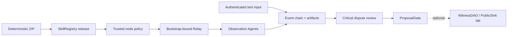

# LoveEngine Witness Skill

[中文说明](README.zh-CN.md)

This repository implements one Skill: loveengine-witness. It is the first
verifiable vertical slice of the LoveEngine/UAS layer in the wider
NaturalDAO/Proof of Love vision.

The Skill verifies a published package, receives observation tasks through an
Agent network, preserves public statements as content-addressed evidence,
coordinates dispute review, and prepares a ProposalGate result. Agents do not
act, vote, or decide real-world truth for people.

## Status

The latest Git tag is v0.6.0-contract-public-pilot. The working target
0.6.1-contract-public-pilot is a candidate, not a published release. The wire
protocol remains loveengine-witness-net/0.6 so M0-M6 schemas and historical
transcripts remain verifiable.

| Area | Status |
| --- | --- |
| Package/Registry trust, signed task/receipt, evidence and dispute review | Implemented locally |
| ProposalGate and verifiable core transcript | Implemented locally |
| WitnessDAO, explicit votes and PublicSink | Optional governance experiment |
| Company livestream adapter and autonomous discovery | Not implemented |
| SSH/Tailscale, public/testnet deployment, production identity, TLS and HA | Not completed |

The local tests demonstrate protocol separation, tamper detection and
repeatability. They do not demonstrate independent real-world organizations,
statement truth, public deployment, or long-term artifact availability.

## Core Flow



The default path stops at ProposalGate. The governance contracts remain useful
for experiments, but they are not the Witness Skill's core completion criterion.
ProposalGate is an off-chain advisory check, not WitnessDAO access control.

The invite tells a node where to connect. A separate NodeTrustPolicyV1, obtained
through a trusted side channel, fixes chain ID, Registry, Publisher,
skill/version, ZIP hash, manifest hash, and allowed issuers. A node does not
treat values reported by the invite, Relay, or task as trust anchors.

## Local Experiment

Requirements: Python 3.11+, uv, and pinned Foundry 1.7.1.

```powershell
uv sync --frozen
uv run loveengine manifest verify
uv run loveengine demo lan-pilot --stage core --events 12 --observers 10 --output .\pilot-output
```

The core experiment builds and anchors a real ZIP, starts a local Anvil and
Relay, uses the public node CLI, verifies artifacts, resolves a fixed dispute,
evaluates ProposalGate, and writes WitnessCoreTranscriptV1. Its output marks
environment: local_anvil and actors_simulated: true.

Run the optional governance extension separately:

```powershell
uv run loveengine demo lan-pilot --stage governance --events 12 --observers 10 --output .\governance-output
```

Start the loopback-only interactive server:

```powershell
uv run loveengine pilot quickstart --root .\pilot --headless
```

Quickstart writes both pilot-invite.json and pilot-trust-policy.json. It is not a
remote deployment command. A dry run prints the plan without creating runtime
state:

```powershell
uv run loveengine pilot quickstart --root .\pilot --dry-run --headless
```

## Roles

| Role | Authority |
| --- | --- |
| Operator | Authenticated session/event writes, close, and explicit evidence finalization |
| Observation Agent | Release/task/evidence verification and signed receipts; never votes |
| Voting Witness | Optional governance lab only; explicitly approves through an external RPC signer |
| Viewer | Read-only session/evidence view; UI is not a trust root |
| Publisher | Builds packages, prepares an unsigned publish plan, and performs read-only Registry verification |

## Safety Boundaries

- Raw private keys, mnemonics, keystores, and write tokens never enter Agent
  context, tasks, fixtures, snapshots, logs, or transcripts.
- Events and artifacts are content-addressed. Finalization rereads the artifact
  bytes; GET endpoints never finalize or mutate evidence.
- Relay accepts bootstrap members only and binds each receipt to its
  authenticated WebSocket node and accepted pending task.
- Offline integrity is not chain trust. A verifier reports trust_bound: true
  only when RPC facts also match an externally supplied trust policy.
- The Windows quickstart does not configure or verify an explicit NTFS ACL for
  its token file; this is loopback experiment isolation, not a production
  multi-user host boundary.
- Raw evidence stays off chain. PublicSink is read-only, and UTO is public
  accounting rather than a tradable asset.

## Documentation

- [Meeting questions and evidence-backed answers](QA.md)
- [Core architecture and data flow](docs/architecture/witness-core-and-data-flow.zh-CN.md)
- [Developer experiments](docs/development/integration-guide.md)
- [CLI reference](docs/api/cli-reference.md)
- [Contract API](docs/api/loveengine-contract-api.md)
- [Engineering master plan](docs/specs/love-engine-master-plan.md)
- [Active optimization specification](docs/specs/love-engine-witness-core-optimization.md)
- [Documentation index](docs/README.md)

## License

LoveEngineSkill is released under Smart Creative Commons Zero (SCC0). See
[LICENSE](LICENSE) and
[license provenance](docs/reference/licenses/scc0-provenance.md).
