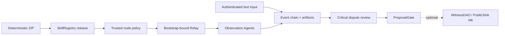

# LoveEngine Witness Skill

[中文说明](README.zh-CN.md)

This repository implements one Skill: loveengine-witness. It is the first
verifiable vertical slice of the LoveEngine/UAS layer in the wider
NaturalDAO/Proof of Love vision.

The Skill verifies a published package, receives observation tasks through an
Agent network, preserves public statements as content-addressed evidence,
coordinates dispute review, and prepares a ProposalGate result. Agents do not
act, vote, or decide real-world truth for people.

## Status

The latest Git tag is `v0.6.0-contract-public-pilot`. PR #11 and the stacked
0.7 PR #12 received owner-authorized self-review and were merged into `main`
on 2026-08-10. The current
source candidate is `0.7.0-invited-public-pilot`, but neither a 0.6.1 nor a 0.7
tag/release asset has been published, so the merged source must not be described
as a released upgrade. The wire protocol remains
`loveengine-witness-net/0.6`, so M0-M6 schemas and historical transcripts remain
verifiable.

| Area | Status |
| --- | --- |
| Package/Registry trust, signed task/receipt, evidence and dispute review | Implemented locally |
| ProposalGate, WitnessCoreTranscriptV1 and local WitnessCoreTranscriptV2 | Implemented locally |
| Dual admin/participant surfaces and InviteV2/trust-policy separation | Implemented and tested locally |
| External signer adapter, signer inspection and Sepolia transaction plans | Implemented and tested locally; no real Clef/Sepolia evidence |
| Tailscale Serve orchestration | Fail-closed preflight and owned restoration implemented; no real Serve evidence |
| WitnessDAO, explicit votes and PublicSink | Optional governance experiment |
| 0.6.1 shared Linux preflight and key-only remote lab tooling | Historical exact-candidate ARM64 acceptance passed |
| Company livestream adapter and autonomous discovery | Not implemented |
| Real invited participants, production identity, TLS/HA and enterprise integration | Not completed |

The complete local gate, one four-hour local core run, and the 2026-08-04
shared ARM64 Linux acceptance of candidate `9e5058e` demonstrate protocol
separation, tamper detection, cross-platform repeatability, recovery, and the
public-node SSH tunnel path. They do not demonstrate independent real-world
organizations, statement truth, public deployment, or long-term artifact
availability. Future candidate engineering acceptance uses a 900-second,
30-event, ten-observer run; that shorter gate is not durability evidence.

The 0.7 code now has the local contracts needed for an invited Sepolia pilot:
two independent RPC observations, `PilotInviteV2`, a separately distributed
trust policy, split loopback listeners, external signer adapters, exact
transaction plans, and a fixed 900-second V2 acceptance shape. It has not yet
produced evidence from an actual Clef 1.17.3 process, Sepolia transaction,
Tailscale Serve session, or three invited remote operators. Geth 1.17.4 removed
the built-in Clef distribution; Geth 1.17.5 is therefore not a valid substitute
or automatic Clef upgrade. The first pilot permits `manual_confirm` only.

The next external experiment is a hybrid boundary: a public Sepolia Registry
anchor with an invited, tailnet-only participant surface. It is not an anonymous
public-internet deployment. Start with the
[invited public pilot runbook](docs/development/runbooks/invited-public-pilot.zh-CN.md)
and its validated
[YAML inventory with secret-file references](config/examples/invited-public-pilot.sepolia.example.yaml).

Run that exact-commit gate from a clean worktree:

```powershell
uv run python .\tools\run_engineering_acceptance.py --output .\tmp\engineering-acceptance\<run-id>
```

The runner executes the complete release gate first, then binds the terminal
core-soak state, manifest package hash, empty runtime diagnostics, secret scan,
and independent offline transcript verification in one machine-readable report.

## Core Flow



The default path stops at ProposalGate. The governance contracts remain useful
for experiments, but they are not the Witness Skill's core completion criterion.
ProposalGate is an off-chain advisory check, not WitnessDAO access control.

The invite tells a node where to connect. A separate NodeTrustPolicyV1, obtained
through a trusted side channel, fixes chain ID, Registry, Publisher,
skill/version, ZIP hash, manifest hash, and allowed issuers. A node does not
treat values reported by the invite, Relay, or task as trust anchors.

For 0.7, the public participant surface is a strict read/WebSocket allowlist and
the admin/write surface remains on a separate loopback listener. `PilotInviteV2`
contains only participant discovery data; it never carries the write token or
admin/RPC/signer endpoints. Sepolia nodes require two distinct RPC endpoints and
an external signer configuration in addition to the trust policy.

## Local Experiment

Requirements: Python 3.11+, uv, and pinned Foundry 1.7.1.

```powershell
uv sync --frozen
uv run loveengine manifest verify
uv run loveengine pilot contracts prepare
uv run loveengine demo lan-pilot --stage core --events 12 --observers 10 --output .\pilot-output
```

Exercise the local V2 contract with the fixed short acceptance shape:

```powershell
uv run loveengine pilot soak --stage core --duration-seconds 900 --events 30 --observers 10 --core-transcript-version 2 --output .\pilot-v2-acceptance
uv run loveengine pilot transcript verify .\pilot-v2-acceptance\witness-core.fixture.json
```

This still reports `environment: local_anvil` and simulated actors. It verifies
the V2 schema and cross-stage bindings, not the external invited-pilot claims.

`pilot contracts prepare` is an explicit prerequisite for real local Pilot
work. It verifies both Forge and Anvil are exactly `1.7.1`, verifies the
versioned `contracts/dependency-lock.json`, runs `forge build --threads 1`,
and emits an artifact/source/dependency attestation. A missing public
dependency is materialized only by a controlled Git checkout of its full
pinned commit from an allowlisted HTTPS repository. Its small, versioned
submodule graph is checked for path, URL, and gitlink before each direct
checkout; deeper declarations fail closed. The final locked tree digest is
then checked. A present but mismatching tree fails closed until an operator
explicitly runs
`pilot contracts prepare --refresh-dependencies`. That refresh stages and
verifies the replacement before switching the named managed directory. The
command canonicalizes managed UTF-8 dependency text to LF before compiling,
orders dependency records by case-sensitive POSIX relative path, and
writes only ignored `contracts/lib`, `contracts/out`, and
`contracts/cache` work products. `package build`, `quickstart`, `lan-pilot`,
and `pilot soak` deliberately fail
closed with this command when those artifacts are absent; they do not compile
or download dependencies during a timed experiment.

The core experiment builds and anchors a real ZIP, starts a local Anvil and
Relay, uses the public node CLI, verifies artifacts, resolves a fixed dispute,
evaluates ProposalGate, and writes WitnessCoreTranscriptV1. Its output marks
environment: local_anvil and actors_simulated: true.

The review nodes do not sign a verdict from a lookup table alone. Before
signing, each node retrieves the finalized bundle, event list, and
content-addressed artifacts from the invite-bound HTTP origin and independently
recomputes the event chain and bundle references.

The cross-platform core runner performs the same explicit preparation as its
first recorded stage and includes the resulting provenance in its machine
report:

```powershell
uv run python .\tools\run_core_experiments.py
```

Run the optional governance extension separately:

```powershell
uv run loveengine demo lan-pilot --stage governance --events 12 --observers 10 --output .\governance-output
```

Start the loopback-only interactive server:

```powershell
uv run loveengine pilot quickstart --root .\pilot --headless
```

Quickstart writes both pilot-invite.json and pilot-trust-policy.json. It is not a
remote deployment command. A dry run prints the plan without creating runtime
state:

```powershell
uv run loveengine pilot quickstart --root .\pilot --dry-run --headless
```

## Historical 0.6.1 Shared Remote Lab

This pre-enterprise remote lab is retained as 0.6.1 historical evidence. It
keeps Pilot and Anvil on the remote loopback
interface. It pins the SSH host key, requires public-key authentication, runs a
read-only resource gate, deploys one clean commit to a unique directory, keeps
one CPU reserved for existing work (one lab CPU on a two-vCPU host; otherwise
at most two), applies lower scheduling priority, and downloads the
report/transcript for another local offline verification. Run mode also maps
the remote loopback through an SSH tunnel and proves that the public node CLI
starts three authenticated processes before task submission; each receives its
own post-connection task, verifies retrievable finalized evidence, and returns
an individually bound receipt.

Before upload, the runner verifies the locally prepared dependency trees
against `contracts/dependency-lock.json` and builds a deterministic dependency
ZIP with a canonical manifest and per-file SHA-256 values. The remote installer
binds that ZIP to the local archive hash, rejects links, duplicate entries and
path escapes, verifies the complete staged trees, then atomically installs
`contracts/lib`. The shared host therefore performs no Git dependency fetch.

```powershell
uv run python .\tools\run_remote_lab.py preflight --host <host> --user <user> --identity-file <ssh-key> --known-hosts .\tmp\remote-known-hosts
uv run python .\tools\run_remote_lab.py run --host <host> --user <user> --identity-file <ssh-key> --known-hosts .\tmp\remote-known-hosts
```

The remote runner deliberately has no password option and does not use sudo,
systemd, or public binds. Its owned core and Quickstart groups have bounded,
identity-checked watchdogs. Both shared-host launchers acquire the same
per-user advisory lock, re-check the capacity gate, and pass a one-shot POSIX
FD lease to the supervisor; an execution-time rejection is reported as
`blocked_by_resource_guard`, not as a failed experiment. The runner accepts
that rejection only when its preflight has the current schema,
`safe_to_run:false`, non-empty reasons, `mutated_host:false`, and the exact
requested workspace and resource thresholds. The detached
Quickstart supervisor creates its watchdog before its Pilot child and writes
its ready record only after both exist; the runner verifies watchdog liveness
before task submission and verifies requested teardown after cleanup. That
teardown is not evidence of natural Quickstart completion. See the
[shared-host runbook](docs/development/runbooks/remote-lab-flow.zh-CN.md).
The launcher normalizes its acquired shared-lock descriptor to `>=3`; the
supervisor and watchdog reject lower descriptors and descriptors for another
file, then reassert an exclusive advisory lock on the inherited descriptor.
Liveness verification binds the descriptor through `/proc/<pid>/fd/<fd>` to
the canonical per-user lock inode and confirms the lock is still held before it
accepts a guardian.
Startup-failure cleanup follows the same rule: without the expected PID start
tick, private session/group identity, canonical launcher path, and mode, it
does not signal a process group. Success and failure both produce a
machine-readable report. The final
postflight records whether process inspection succeeded and no lab process
remained; one-minute load can still reflect the experiment that just ended.

Before a core or Quickstart supervisor, watchdog, or Anvil child is created,
the corresponding launcher obtains a per-user advisory lock and evaluates the
shared-host resource gate in its unique output directory. It passes a
short-lived, EOF-delimited POSIX FD lease directly to the supervisor; the
supervisor consumes it once, starts the guardian, and runs the workload in the
same owned process group. No reusable handoff file, nonce option, PID
exemption, or `--skip-preflight` switch exists. A rejected core gate starts no
owned core group and leaves a structured `core-experiment-report.json`; a
Quickstart rejection is returned with the same structured preflight and exit
status 4. A failed `contracts-prepare` step may retain only an allowlisted
dependency, Git stage, and exit-code diagnostic; raw Git and Forge output stays
on the constrained host and is never copied into the remote-lab report.
The final report also requires `contract_dependency_bundle.verified:true` and
matching archive, manifest, dependency-tree, file-count, and byte-count fields
from the local build and remote installation.
The lock coordinates compliant LoveEngine processes only: it is not a hostile
same-UID security boundary or a promise that unrelated host work cannot begin
after the instantaneous capacity snapshot.

The core guardian persists an identity-bound terminal result before exiting.
The runner requires normal completion, not merely guardian disappearance, and
downloads only canonical files below the unique deployment directory. A lost
startup SSH connection attempts cleanup only after recovering that owned,
identity-bound launch record; otherwise the bounded guardian remains the
fail-closed cleanup mechanism.

The latest accepted short cross-host run used candidate commit
`9e5058ec51942a8c1e4004457d58c05d2ea5b824`. It produced three observation
receipts, three review receipts, Gate ready, and passing recovery checks. The
downloaded transcript verified as `offline_integrity` with `trust_bound:false`;
the tunnel started three public node CLI processes, each received a
post-connection evidence-verified task and returned its own bound receipt.
Relay recorded `acked:3` and `receipt_confirmed:3`, and the post-run read-only
gate found no related process left behind. The exact same candidate also
completed a four-hour local core run with 240 events, ten read-only observers,
restart/reconnect recovery, all report checks true, zero secret findings, empty
stderr, and independent offline transcript verification. These are simulated
profiles and processes, not proof of socially independent witnesses or a
promise of production availability.

## Roles

| Role | Authority |
| --- | --- |
| Operator | Authenticated session/event writes, close, and explicit evidence finalization |
| Observation Agent | Release/task/evidence verification and signed receipts; never votes |
| Voting Witness | Optional governance lab only; explicitly approves through an external RPC signer |
| Viewer | Read-only session/evidence view; UI is not a trust root |
| Publisher | Builds packages, reviews exact transaction plans, manually confirms through an external signer, submits after revalidation, and verifies Registry state |

## Safety Boundaries

- Raw private keys, mnemonics, keystores, and write tokens never enter Agent
  context, tasks, fixtures, snapshots, logs, or transcripts.
- Events and artifacts are content-addressed. Finalization rereads the artifact
  bytes; GET endpoints never finalize or mutate evidence.
- Relay accepts bootstrap members only and binds each receipt to its
  authenticated WebSocket node and accepted pending task.
- Public task submission is idempotent only for byte-identical signed tasks.
  Nodes durably bind task ID and issuer nonce, persist receipts before sending,
  and use bounded reconnect plus a Relay-confirmed receipt handshake to recover
  an ACK-loss window without executing the task twice.
- One observation execution is capped at 10,000 new events and 64 MiB of
  artifacts; one review is capped at 1,000 events and 32 MiB. Each artifact is
  capped at 8 MiB.
- Offline integrity is not chain trust. A verifier reports trust_bound: true
  only when RPC facts also match an externally supplied trust policy.
- The Windows quickstart does not configure or verify an explicit NTFS ACL for
  its token file; this is loopback experiment isolation, not a production
  multi-user host boundary.
- Raw evidence stays off chain. PublicSink is read-only, and UTO is public
  accounting rather than a tradable asset.
- Remote lab automation requires a pinned host key and dedicated SSH public key;
  passwords are never accepted by the runner.

## Documentation

- [Meeting questions and evidence-backed answers](QA.md)
- [Core architecture and data flow](docs/architecture/witness-core-and-data-flow.zh-CN.md)
- [Developer experiments](docs/development/integration-guide.md)
- [CLI reference](docs/api/cli-reference.md)
- [Contract API](docs/api/loveengine-contract-api.md)
- [Engineering master plan](docs/specs/love-engine-master-plan.md)
- [0.7 invited public pilot specification](docs/specs/love-engine-invited-public-pilot.md)
- [Sepolia invited public pilot runbook](docs/development/runbooks/invited-public-pilot.zh-CN.md)
- [Pilot YAML template with secret-file references](config/examples/invited-public-pilot.sepolia.example.yaml)
- [0.6.1 remote lab specification](docs/specs/love-engine-pre-enterprise-remote-lab.md)
- [Shared-host runbook](docs/development/runbooks/remote-lab-flow.zh-CN.md)
- [Documentation index](docs/README.md)

## License

LoveEngineSkill is released under Smart Creative Commons Zero (SCC0). See
[LICENSE](LICENSE) and
[license provenance](docs/reference/licenses/scc0-provenance.md).
