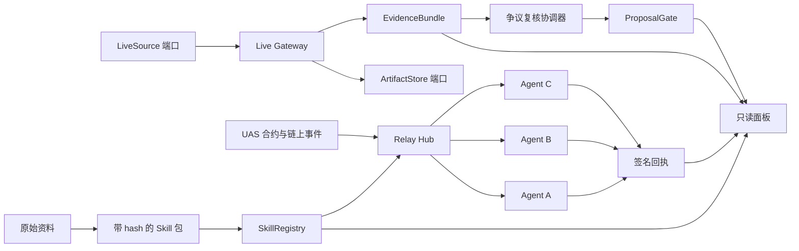
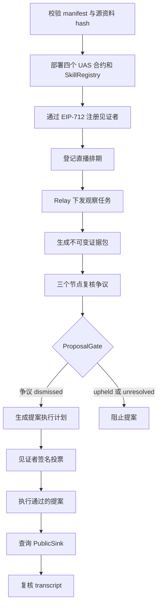
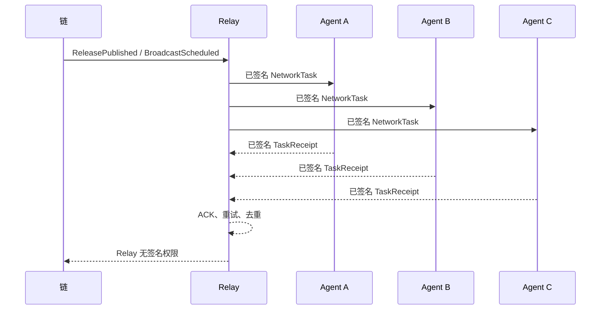

# LoveEngine Witness Skill

[English README](README.md)

LoveEngine Witness Skill 是面向 Agent 网络的公共利益见证协议。它将资料溯源、EIP-712 身份与任务、本地治理合约、Relay 网络、证据产物和可重放 transcript 组合成可验证 Skill，同时保证私钥不进入 Agent 上下文。

当前稳定演示版本：`0.4.0-live-evidence-pilot`。
上一版纯网络演示：`0.3.1-demo-ready`。
当前活动版本：`0.6.0-contract-public-pilot`，协议为 `loveengine-witness-net/0.6`。
上一版局域网试点：`0.5.0-lan-pilot`。

## Skill 模型

LoveEngine 采用“薄指令层、厚协议运行时”。面向 Codex 的 `SKILL.md`
只定义触发条件、验证流程、命令导航和安全边界；实际协议由版本化
manifest、Schema、Python 用例、适配器、合约和 transcript 承担。
这样可以保持 Agent 上下文精简，同时保证行为确定、可测试、可复核。

## 快速开始

| 角色 | 你负责什么 | 最短路径 |
| --- | --- | --- |
| 主持人 / Operator | 启动试点服务、创建直播、发布文字、关闭 session、查看 Gate | 运行 `pilot quickstart`，打开 `/operator/` |
| 观察 Agent 节点 | 通过 invite 加入，观察文字流，签 observation/review 回执 | 安装包或 Plugin 后，用 invite 连接；不需要钱包私钥 |
| 投票见证者 | Gate 放行后手动批准一次链上投票 | 只运行 `witness vote approve`，私钥留在外部 signer/RPC 钱包 |
| 只读观察者 | 看直播、证据、节点回执和链上状态 | 浏览器打开 `/demo/`，不需要 token、不需要钱包 |
| 发布者 / Publisher | 构建确定性 ZIP，发布 SkillRegistry release | 运行 package/registry 命令，维护 package hash |

完整分角色流程见[参与者运行手册](docs/development/participant-runbook.zh-CN.md)。

## 系统架构



可替换模块见[扩展接口文档](docs/api/extension-interfaces.md)。领域层不依赖具体 signer、直播平台、对象存储、数据库或传输方式。

## 全流程



## M3 三节点时序



## 目录结构

```text
contracts/                 Foundry UAS 合约与 SkillRegistry
docs/api/                  公开协议与扩展接口
docs/development/          接入指南、演示手册和验收报告
docs/reference/            当前有效的源约束
docs/archive/              历史源稿和已实施规格
docs/specs/                当前总规划和活动 SPEC
examples/                  无秘密的 fixture 与 transcript
schemas/                   JSON Schema Draft 2020-12
skills/loveengine-witness/ 可验证 Skill manifest 与 onboarding
src/loveengine_witness/    Python 领域、用例、端口、适配器和 CLI
tests/                     单元、合约和端到端测试
tools/                     仓库及兼容性检查
```

## 操作台与只读面板

Pilot Server 提供需要鉴权的主持人操作台，以及完全分离的只读证据面板。
token 只保存在当前页面内存；公开面板不能写入或签名。以下截图由仓库内
无秘密的本地 UI fixture 实际渲染。


## 快速运行：主持人本地启动

```powershell
uv sync --frozen
uv run loveengine pilot quickstart --root .\pilot --open-ui
uv run loveengine pilot status --url http://127.0.0.1:8780
```

`--open-ui` 会尝试打开主持人页面。没有图形界面、远程 Debian 或只想后台
运行时改用 `--headless`；命令会在 stdout JSON 中输出 `operator_url`、
`dashboard_url`、`invite_path` 和 `token_file`。手动打开：

- 主持人操作台：`http://127.0.0.1:8780/operator/?lang=zh-CN`
- 只读面板：`http://127.0.0.1:8780/demo/?lang=zh-CN`

`quickstart` 是长运行服务命令；`pilot status` 请在第二个终端执行。需要从
发布包一路跑到 PublicSink 并生成 transcript 时，使用
`uv run loveengine demo lan-pilot --output .\pilot-output`。

完整命令、安装包、链、snapshot、显式投票、后台 soak 和故障排查见
[CLI 与运行手册](docs/api/cli-reference.md)。

## 安全边界

- 私钥、助记词、keystore 和 token 不进入 Agent context、fixture、日志或 transcript。
- Relayer 只能提交签名，不能代替见证者或节点签名。
- 签名任务必须绑定 chainId、合约、issuer、recipient、payloadHash、nonce 和 deadline。
- 原始证据不上链；提案和合约只使用内容 hash。
- Agent 不得自动签投票。每个见证者必须单独执行
  `loveengine witness vote approve`，并使用外部 RPC signer。
- `PublicSink` 始终只读。

## 文档入口

- 架构与范围：[工程总规划](docs/specs/love-engine-master-plan.md)和
  [M6 活动 SPEC](docs/specs/love-engine-contract-public-pilot-spec.md)。
- 接口与命令：[API 入口](docs/api/README.md)和
  [CLI 与运行手册](docs/api/cli-reference.md)。
- 开发与运维：[接入指南](docs/development/integration-guide.md)和
  [参与者运行手册](docs/development/participant-runbook.zh-CN.md)。
- 合约对接：[contract2 对照与建议](docs/development/contract2-comparison-and-recommendations.md)。
- 技术背景：[LoveEngine 技术选型](docs/articles/loveengine-technical-architecture.zh-CN.md)。
- 资料溯源：[资料索引](docs/kb/source-inventory.md)和
  [SCC0 来源说明](docs/reference/licenses/scc0-provenance.md)。

## License

LoveEngineSkill 采用 Smart Creative Commons Zero（SCC0）。详见
[LICENSE](LICENSE)和[SCC0 来源说明](docs/reference/licenses/scc0-provenance.md)。
