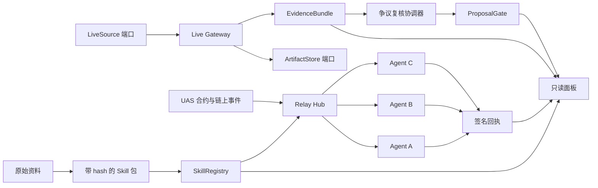
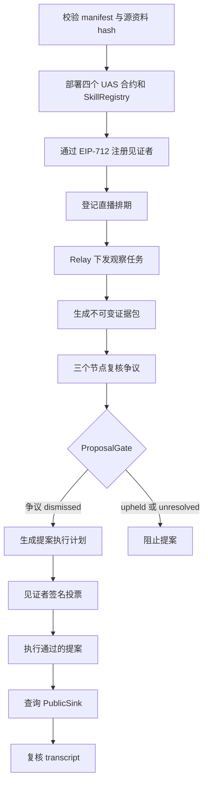
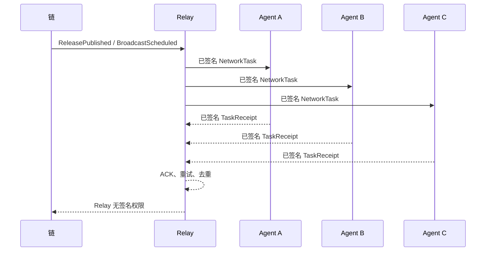

# LoveEngine Witness Skill

[English README](README.md)

LoveEngine Witness Skill 是面向 Agent 网络的公共利益见证协议。它将资料溯源、EIP-712 身份与任务、本地治理合约、Relay 网络、证据产物和可重放 transcript 组合成可验证 Skill，同时保证私钥不进入 Agent 上下文。

当前稳定演示版本：`0.4.0-live-evidence-pilot`。
上一版纯网络演示：`0.3.1-demo-ready`。

## 系统架构



可替换模块见[扩展接口文档](docs/api/extension-interfaces.md)。领域层不依赖具体 signer、直播平台、对象存储、数据库或传输方式。

## 全流程



## M3 三节点时序



## 目录结构

```text
contracts/                 Foundry UAS 合约与 SkillRegistry
docs/api/                  公开协议与扩展接口
docs/development/          接入指南、演示手册和验收报告
docs/reference/            当前有效的源约束
docs/archive/              历史源稿和已实施规格
docs/specs/                当前总规划和活动 SPEC
examples/                  无秘密的 fixture 与 transcript
schemas/                   JSON Schema Draft 2020-12
skills/loveengine-witness/ 可验证 Skill manifest 与 onboarding
src/loveengine_witness/    Python 领域、用例、端口、适配器和 CLI
tests/                     单元、合约和端到端测试
tools/                     仓库及兼容性检查
```

## 环境准备

- Python 3.11+
- [uv](https://docs.astral.sh/uv/)
- Foundry `1.7.1`

```powershell
uv sync --frozen
cd contracts
forge install foundry-rs/forge-std@v1.9.7 --no-git
forge install OpenZeppelin/openzeppelin-contracts@v5.3.0 --no-git
cd ..
```

## 完整验证

```powershell
uv run python .\tools\check.py
uv run pytest -m "not integration" -q

cd contracts
forge test
cd ..

uv run pytest .\tests\test_demo.py
uv run pytest .\tests\integration\test_network_demo.py
uv run pytest .\tests\integration\test_live_evidence_demo.py
```

## 运行演示

```powershell
uv run loveengine manifest verify

uv run loveengine demo local-loop --output .\examples\transcripts
uv run loveengine transcript verify .\examples\transcripts\local-loop.fixture.json

uv run loveengine network demo --nodes 3 --output .\examples\transcripts
uv run loveengine network transcript verify .\examples\transcripts\network-pilot.fixture.json

uv run loveengine demo live-evidence --nodes 3 --input .\examples\live\live-session.fixture.ndjson --output .\examples\transcripts
uv run loveengine live transcript verify .\examples\transcripts\live-review.fixture.json
```

M3 对外演示顺序见[演示手册](docs/development/m3-demo-runbook.md)，验证证据见[验收报告](docs/development/m3-acceptance-report.md)。

## CLI 分组

```text
manifest  node  fixture  evidence  transcript
eip712    relayer  registry  bootstrap
relay     network  live  dispute  review
proposal  demo
```

成功结果写入 stdout JSON；错误写入 stderr，并使用稳定错误码。

## 安全边界

- 私钥、助记词、keystore 和 token 不进入 Agent context、fixture、日志或 transcript。
- Relayer 只能提交签名，不能代替见证者或节点签名。
- 签名任务必须绑定 chainId、合约、issuer、recipient、payloadHash、nonce 和 deadline。
- 原始证据不上链；提案和合约只使用内容 hash。
- M4 复核任务不得请求或生成投票签名。
- `PublicSink` 始终只读。

## 阅读顺序

1. [工程总规划](docs/specs/love-engine-master-plan.md)
2. [M4 活动 SPEC](docs/specs/love-engine-live-evidence-pilot-spec.md)
3. [API 入口](docs/api/README.md)
4. [开发接入指南](docs/development/integration-guide.md)
5. [资料索引](docs/kb/source-inventory.md)

## License

仓库尚未选择统一开源许可证，不得从历史 SCC0 或 DAism 资料推断许可证。
