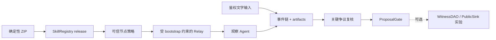

# LoveEngine Witness Skill

[English README](README.md)

本仓库只实现一个 Skill：loveengine-witness。它是 NaturalDAO / Proof of Love
总体愿景中 LoveEngine/UAS 层的第一条可验证纵向切片。

该 Skill 验证发布包，通过 Agent 网络接收观察任务，把公众表达保存为内容寻址
证据，协调争议复核，并整理 ProposalGate 结果。Agent 不替人执行、投票或裁决
现实事实。

## 当前状态

最新 Git tag 是 v0.6.0-contract-public-pilot。工作目标
0.6.1-contract-public-pilot 是 candidate，不是已发布 release。线协议继续使用
loveengine-witness-net/0.6，因此 M0-M6 schema 和历史 transcript 仍可验证。

| 范围 | 状态 |
| --- | --- |
| package/Registry 信任、签名任务/回执、证据和争议复核 | 已在本机实现 |
| ProposalGate 和可验证核心 transcript | 已在本机实现 |
| WitnessDAO、显式投票和 PublicSink | 可选治理实验 |
| 共享 Linux 资源门和 key-only 远程实验工具 | 已实现；精确 candidate 的 ARM64 验收已通过 |
| 公司直播 adapter 和自动发现 | 未实现 |
| Tailscale 直接服务、公网/测试网、生产身份、TLS 和 HA | 未完成 |

完整本机门、一次四小时本机 core 运行，以及 2026-08-04 对 candidate `9e5058e`
的共享 ARM64 Linux 验收，证明协议分权、篡改检测、跨平台复跑、恢复和 SSH tunnel
公共节点路径；它们不证明现实组织彼此独立、发言内容为真、已经公开部署或 artifact
能长期可用。后续 candidate 的工程验收统一使用 900 秒、30 个事件和 10 个只读观察者；
该短门不构成长周期稳定性证据。

在干净工作树中执行唯一的精确提交验收入口：

```powershell
uv run python .\tools\run_engineering_acceptance.py --output .\tmp\engineering-acceptance\<run-id>
```

该脚本先执行完整发布门，再把终态 core soak、manifest package hash、空运行时
诊断、秘密扫描和独立 transcript 离线复验绑定到一份机器可读报告中。

## 核心流程



默认主路径在 ProposalGate 结束。治理合约仍可用于实验，但不再作为 Witness Skill
核心完成条件。ProposalGate 是链下 advisory check，不是 WitnessDAO 访问控制。

invite 告诉节点连接到哪里；通过可信旁路获得的独立 NodeTrustPolicyV1 固定
chain ID、Registry、Publisher、skill/version、ZIP hash、manifest hash 和允许
issuer。节点不会把 invite、Relay 或任务自报的值当信任根。

## 本机实验

需要 Python 3.11+、uv 和固定 Foundry 1.7.1。

```powershell
uv sync --frozen
uv run loveengine manifest verify
uv run loveengine pilot contracts prepare
uv run loveengine demo lan-pilot --stage core --events 12 --observers 10 --output .\pilot-output
```

`pilot contracts prepare` 是真实本机 Pilot 的显式前置步骤。它确认 Forge 和 Anvil
均精确为 `1.7.1`，核验版本化的 `contracts/dependency-lock.json`，执行
`forge build --threads 1`，并输出 artifact、源码和依赖 attestation。公开依赖缺少时
才从允许的 HTTPS 仓库受控检出完整固定 commit；其小型、版本化 submodule 图会先逐项
核验路径、URL 和 gitlink，再初始化每个 direct submodule，出现更深层声明则失败关闭，
随后核验最终锁定树摘要；已有目录若与锁定树摘要不符则默认失败关闭，只有显式执行
`pilot contracts prepare --refresh-dependencies` 才会在 staging 中完成核验后切换该受管
目录。它会在编译前将受管依赖中的 UTF-8 文本规范化为 LF，并按区分大小写的 POSIX
相对路径排序依赖记录，只写入被忽略的
`contracts/lib`、`contracts/out` 和 `contracts/cache` 工作产物。
`package build`、`quickstart`、`lan-pilot` 和 `pilot soak` 在产物缺失或 attestation
失配时会明确失败；它们不会在计时实验中隐式编译或下载依赖。

核心实验构建并锚定真实 ZIP，启动本机 Anvil 和 Relay，使用公开 node CLI，校验
artifact、复核固定争议、执行 ProposalGate，并写出 WitnessCoreTranscriptV1。
结果明确标记 environment: local_anvil 和 actors_simulated: true。

复核节点不是只从本地 verdict 表取一个结论就签名。签名前，每个节点都会从 invite
绑定的 HTTP origin 取回 finalized bundle、事件列表和内容寻址 artifact，独立复算
事件链、artifact bytes 和 bundle 引用。

跨平台 core runner 将同一准备命令作为第一个可记录阶段运行，并将其 provenance
写入机器报告：

```powershell
uv run python .\tools\run_core_experiments.py
```

可选治理扩展单独执行：

```powershell
uv run loveengine demo lan-pilot --stage governance --events 12 --observers 10 --output .\governance-output
```

启动严格限制在 loopback 的交互服务：

```powershell
uv run loveengine pilot quickstart --root .\pilot --headless
```

Quickstart 同时生成 pilot-invite.json 和 pilot-trust-policy.json；它不是远程部署
命令。dry-run 只输出计划，不创建运行状态：

```powershell
uv run loveengine pilot quickstart --root .\pilot --dry-run --headless
```

## 共享远程实验

企业衔接前的 remote lab 让 Pilot 和 Anvil 继续只监听远端 loopback。它固定 SSH
host key，只接受 public-key 认证，先执行只读资源门，再把一个干净 commit 部署到
唯一目录；实验始终为既有任务保留一颗 CPU（2 vCPU 主机只绑定 1 核，否则最多
绑定 2 核），并降低调度优先级，最后下载报告和 transcript，
在本机再次离线验证。run 模式还会建立本机 SSH tunnel，使用公开 node CLI 连接
远端 loopback Quickstart。runner 先启动 3 个独立鉴权进程，三者全部连接后才
分别提交任务；每个节点取回并复算各自的 finalized evidence，再返回与
node/task/dispute 分别绑定的 receipt。

上传前，runner 会在本机核对 `contracts/dependency-lock.json` 与已准备的依赖树，
生成带规范 manifest 和逐文件 SHA-256 的确定性依赖 ZIP。远端安装器把 ZIP 绑定到
本机 archive hash，拒绝链接、重复条目和路径逃逸，完整验证 staging 树后再原子安装
`contracts/lib`；共享主机不再执行 Git 依赖下载。

```powershell
uv run python .\tools\run_remote_lab.py preflight --host <host> --user <user> --identity-file <ssh-key> --known-hosts .\tmp\remote-known-hosts
uv run python .\tools\run_remote_lab.py run --host <host> --user <user> --identity-file <ssh-key> --known-hosts .\tmp\remote-known-hosts
```

远程 runner 故意不提供 password 参数，也不使用 sudo、systemd 或公开端口绑定。
它为自己创建的 core 与 Quickstart 进程组设置有上限、身份绑定的 watchdog；两种 shared-host
launcher 都取得同一按用户范围的 advisory lock，重新执行资源门，再把一次性 POSIX FD lease
交给 supervisor。执行时资源拒绝会返回结构化的 `blocked_by_resource_guard`，而不是被归类为
实验失败。runner 只接受带有当前 schema、`safe_to_run:false`、非空 reasons、
`mutated_host:false`，并且与本次 workspace/资源阈值精确绑定的拒绝记录。脱离 SSH 的
Quickstart supervisor 会先创建 watchdog、再启动 Pilot child，并且只在
二者都已存在后写出 ready record；runner 在提交任务前检查 watchdog 存活，并在清理后验证
请求式回收。该回收不证明 Quickstart 自然完成。完整步骤见
[共享主机 runbook](docs/development/runbooks/remote-lab-flow.zh-CN.md)。
启动失败时也遵守同一边界：没有预期 PID start tick、私有 session/group 身份、canonical
启动脚本和 mode 的完整匹配，就不得向进程组发送信号。成功和失败都会产生机器可读报告。最终 postflight 明确记录进程检查是否成功、是否
无本次实验残留；一分钟负载仍可能包含刚结束实验的影响。

core 或 Quickstart supervisor、watchdog 或 Anvil child 创建前，对应 launcher 会先取得按用户
范围的 advisory lock，并在本次唯一输出目录执行共享主机资源门。通过结果只以短时、EOF 分隔的
POSIX FD lease 直接传给 supervisor；supervisor 只能消费一次，随后创建 guardian，并在同一
受管进程组内执行 workload。不存在可重用的 handoff 文件、nonce 参数、PID 豁免或
`--skip-preflight` 开关。core 资源门拒绝时不会启动本次 core 进程组，并会留下结构化
`core-experiment-report.json`；Quickstart 拒绝使用同样的结构化 preflight 并返回退出码 4。该 lock 只协调遵守协议的 LoveEngine 进程；它不是
针对同一 Unix UID 恶意进程的安全边界，也不承诺容量瞬时快照之后其他主机任务不会启动。
最终报告还必须包含 `contract_dependency_bundle.verified:true`，并证明本机构建与
远端安装的 archive、manifest、依赖树、文件数和字节数完全一致。

core guardian 在退出前会持久化与目标身份绑定的终态结果。runner 要求正常完成，不能只看
guardian 已消失，并且只下载唯一 deployment 目录下的 canonical 文件。SSH 在启动阶段断开
时，runner 只有恢复到该受管、身份绑定的 launch record 后才会尝试清理；否则由有期限的
guardian 作为 fail-closed 清理机制。

最新一次已验收的短时跨主机实验使用 candidate commit
`9e5058ec51942a8c1e4004457d58c05d2ea5b824`。它得到 3 个观察回执、3 个复核
回执、Gate ready 和恢复测试通过；下载 transcript 为 `offline_integrity` /
`trust_bound:false`。tunnel 启动 3 个公开 node CLI 进程，三者各自在连接后收到
一份 evidence-verified 任务并返回自己的绑定回执；Relay 记录 `acked:3` 和
`receipt_confirmed:3`，实验后的只读门禁未发现相关残留进程。同一 candidate 还完成
了 240 个事件、10 个只读观察者的四小时本机 core 运行；重启/重连恢复、全部报告门、
零秘密发现、空 stderr 和独立离线 transcript 复验均通过。三个 profile/进程仍是
模拟 actor，这些结果不代表现实社会独立性或生产长期可用性。

## 角色

| 角色 | 权限 |
| --- | --- |
| 主持人 / Operator | 鉴权创建/写入/关闭 session，并显式 finalize evidence |
| 观察 Agent | 验证 release、任务和证据，签任务回执；绝不投票 |
| 投票见证者 | 只参加可选治理实验，通过外部 RPC signer 显式批准 |
| 只读观察者 | 只读查看 session/evidence；UI 不是信任根 |
| 发布者 | 构建包、生成未签名 publish plan、执行 Registry 只读验证 |

## 安全边界

- 私钥、助记词、keystore 和写 token 不进入 Agent context、任务、fixture、
  snapshot、日志或 transcript。
- event 和 artifact 都是内容寻址；finalize 会重新读取 artifact bytes；GET
  接口不会 finalize 或改变 evidence。
- Relay 只接受 bootstrap 成员，并把 receipt 绑定到当前鉴权 WebSocket 节点和
  它已接受的 pending task。
- 公开任务入口只把字节完全相同的签名任务重试视为幂等。节点持久绑定 task ID 与
  issuer nonce，发送前保存回执，并用有界重连和 receipt confirmation 覆盖 ACK
  丢失窗口；Relay 会再确认该 confirmation，避免连接关闭前留下不确定状态。
- 观察任务每次执行最多处理 10,000 个新事件和 64 MiB artifact，复核任务最多
  1,000 个事件和 32 MiB artifact；单个 artifact 上限均为 8 MiB。
- 离线完整性不等于链上信任。只有 RPC 事实同时匹配外部 trust policy 时，
  verifier 才返回 trust_bound: true。
- Windows 本机 token 文件尚未显式配置或验收 NTFS ACL，只能视为 loopback 实验
  隔离，不是生产多用户主机的权限边界。
- 原始证据不上链；PublicSink 只读；UTO 是公共记账，不是可交易资产。
- remote lab 必须固定 host key 并使用专用 SSH public key；runner 不接受密码。

## 文档入口

- [会议问题与代码事实问答](QA.md)
- [核心架构与数据流](docs/architecture/witness-core-and-data-flow.zh-CN.md)
- [开发实验指南](docs/development/integration-guide.md)
- [CLI 参考](docs/api/cli-reference.md)
- [合约 API](docs/api/loveengine-contract-api.md)
- [工程总规划](docs/specs/love-engine-master-plan.md)
- [活动远程实验规格](docs/specs/love-engine-pre-enterprise-remote-lab.md)
- [共享主机 runbook](docs/development/runbooks/remote-lab-flow.zh-CN.md)
- [完整文档索引](docs/README.md)

## License

LoveEngineSkill 采用 Smart Creative Commons Zero（SCC0）。详见
[LICENSE](LICENSE)和[来源说明](docs/reference/licenses/scc0-provenance.md)。
