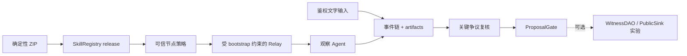

# LoveEngine Witness Skill

[English README](README.md)

本仓库只实现一个 Skill：loveengine-witness。它是 NaturalDAO / Proof of Love
总体愿景中 LoveEngine/UAS 层的第一条可验证纵向切片。

该 Skill 验证发布包，通过 Agent 网络接收观察任务，把公众表达保存为内容寻址
证据，协调争议复核，并整理 ProposalGate 结果。Agent 不替人执行、投票或裁决
现实事实。

## 当前状态

最新 Git tag 是 v0.6.0-contract-public-pilot。工作目标
0.6.1-contract-public-pilot 是 candidate，不是已发布 release。线协议继续使用
loveengine-witness-net/0.6，因此 M0-M6 schema 和历史 transcript 仍可验证。

| 范围 | 状态 |
| --- | --- |
| package/Registry 信任、签名任务/回执、证据和争议复核 | 已在本机实现 |
| ProposalGate 和可验证核心 transcript | 已在本机实现 |
| WitnessDAO、显式投票和 PublicSink | 可选治理实验 |
| 共享 Linux 资源门和 key-only 远程实验工具 | 已实现；ARM64 Linux 短验收已通过 |
| 公司直播 adapter 和自动发现 | 未实现 |
| Tailscale 直接服务、公网/测试网、生产身份、TLS 和 HA | 未完成 |

本机测试和 2026-07-27 的共享 ARM64 Linux 短验收（source commit `63909b9`）
证明协议分权、篡改检测、跨平台复跑和 SSH tunnel 公共节点路径；它们不证明现实
中的组织彼此独立、发言内容为真、已经公开部署或 artifact 能长期可用。

## 核心流程



默认主路径在 ProposalGate 结束。治理合约仍可用于实验，但不再作为 Witness Skill
核心完成条件。ProposalGate 是链下 advisory check，不是 WitnessDAO 访问控制。

invite 告诉节点连接到哪里；通过可信旁路获得的独立 NodeTrustPolicyV1 固定
chain ID、Registry、Publisher、skill/version、ZIP hash、manifest hash 和允许
issuer。节点不会把 invite、Relay 或任务自报的值当信任根。

## 本机实验

需要 Python 3.11+、uv 和固定 Foundry 1.7.1。

```powershell
uv sync --frozen
uv run loveengine manifest verify
uv run loveengine demo lan-pilot --stage core --events 12 --observers 10 --output .\pilot-output
```

核心实验构建并锚定真实 ZIP，启动本机 Anvil 和 Relay，使用公开 node CLI，校验
artifact、复核固定争议、执行 ProposalGate，并写出 WitnessCoreTranscriptV1。
结果明确标记 environment: local_anvil 和 actors_simulated: true。

可选治理扩展单独执行：

```powershell
uv run loveengine demo lan-pilot --stage governance --events 12 --observers 10 --output .\governance-output
```

启动严格限制在 loopback 的交互服务：

```powershell
uv run loveengine pilot quickstart --root .\pilot --headless
```

Quickstart 同时生成 pilot-invite.json 和 pilot-trust-policy.json；它不是远程部署
命令。dry-run 只输出计划，不创建运行状态：

```powershell
uv run loveengine pilot quickstart --root .\pilot --dry-run --headless
```

## 共享远程实验

企业衔接前的 remote lab 让 Pilot 和 Anvil 继续只监听远端 loopback。它固定 SSH
host key，只接受 public-key 认证，先执行只读资源门，再把一个干净 commit 部署到
唯一目录；实验最多使用两个 CPU、降低调度优先级，最后下载报告和 transcript，
在本机再次离线验证。run 模式还会建立本机 SSH tunnel，使用公开 node CLI 连接
远端 loopback Quickstart，证明节点在连接后收到新任务并返回一个绑定 receipt。

```powershell
uv run python .\tools\run_remote_lab.py preflight --host <host> --user <user> --identity-file <ssh-key> --known-hosts .\tmp\remote-known-hosts
uv run python .\tools\run_remote_lab.py run --host <host> --user <user> --identity-file <ssh-key> --known-hosts .\tmp\remote-known-hosts
```

远程 runner 故意不提供 password 参数，也不使用 sudo、systemd、公开端口绑定或
自动清理。完整步骤见[共享主机 runbook](docs/development/runbooks/remote-lab-flow.zh-CN.md)。

已完成的短验收得到 3 个观察回执、3 个复核回执、Gate ready、恢复测试通过；
下载 transcript 为 `offline_integrity` / `trust_bound:false`。公开 node CLI 在
连接后收到一个签名任务，Relay 保存一个绑定回执，实验后的只读门禁未发现相关
残留进程。30 分钟和 4 小时 soak 仍未执行。

## 角色

| 角色 | 权限 |
| --- | --- |
| 主持人 / Operator | 鉴权创建/写入/关闭 session，并显式 finalize evidence |
| 观察 Agent | 验证 release、任务和证据，签任务回执；绝不投票 |
| 投票见证者 | 只参加可选治理实验，通过外部 RPC signer 显式批准 |
| 只读观察者 | 只读查看 session/evidence；UI 不是信任根 |
| 发布者 | 构建包、生成未签名 publish plan、执行 Registry 只读验证 |

## 安全边界

- 私钥、助记词、keystore 和写 token 不进入 Agent context、任务、fixture、
  snapshot、日志或 transcript。
- event 和 artifact 都是内容寻址；finalize 会重新读取 artifact bytes；GET
  接口不会 finalize 或改变 evidence。
- Relay 只接受 bootstrap 成员，并把 receipt 绑定到当前鉴权 WebSocket 节点和
  它已接受的 pending task。
- 离线完整性不等于链上信任。只有 RPC 事实同时匹配外部 trust policy 时，
  verifier 才返回 trust_bound: true。
- Windows 本机 token 文件尚未显式配置或验收 NTFS ACL，只能视为 loopback 实验
  隔离，不是生产多用户主机的权限边界。
- 原始证据不上链；PublicSink 只读；UTO 是公共记账，不是可交易资产。
- remote lab 必须固定 host key 并使用专用 SSH public key；runner 不接受密码。

## 文档入口

- [会议问题与代码事实问答](QA.md)
- [核心架构与数据流](docs/architecture/witness-core-and-data-flow.zh-CN.md)
- [开发实验指南](docs/development/integration-guide.md)
- [CLI 参考](docs/api/cli-reference.md)
- [合约 API](docs/api/loveengine-contract-api.md)
- [工程总规划](docs/specs/love-engine-master-plan.md)
- [活动远程实验规格](docs/specs/love-engine-pre-enterprise-remote-lab.md)
- [共享主机 runbook](docs/development/runbooks/remote-lab-flow.zh-CN.md)
- [完整文档索引](docs/README.md)

## License

LoveEngineSkill 采用 Smart Creative Commons Zero（SCC0）。详见
[LICENSE](LICENSE)和[来源说明](docs/reference/licenses/scc0-provenance.md)。
