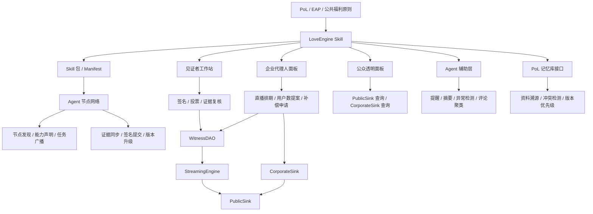

# LoveEngine Skill 开发规格

整理者说明：本规格用于后续开发，不替代 `LoveEngineSkill/` 下的原始记录。版本判断按时间从新到旧：`UAS接口文档.md` 提供协作者整理的合约接口校准，`UAS 见证方案 2.0.md` 是当前见证方案约束层，`UAS 2.md` 和 `Love Engine.md` 提供产品、流程和 UAS/UHAH 背景，`NaturalDAO 开发.md` 提供 PoL、EAP、Skills 和记忆库的上层原则。

## 1. 结论

LoveEngine Skill 的第一版不应做成一个“大而全的福利平台”，也不应先做钱包、交易所或支付网络。最新方向应再往前收敛一步：它首先是一个可在 Agent 网络中复制、安装、传播和运行的见证协议 Skill，其次才是网页工作站和链上账本应用。

- 先定义可分发的 Skill 包：manifest、能力声明、权限边界、工具接口、版本号、源资料引用和行为规则。
- 让 Agent 节点能够发现、安装、注册、接收任务、同步证据、提交签名和转发规则。
- 见证者工作站、企业面板和透明面板是参考实现，不是网络传播的前提。
- 用四个核心合约承载公开账本、流计算、见证治理和企业存证。
- 用 Skill 把直播排期、证据整理、提案阅读、投票签名、公众意见和账本查询串起来。
- 用 Agent 做辅助观察、摘要、提醒、异常提示和证据交叉校验，不让 Agent 成为不可追责的裁判。
- 先支持文字直播与结构化证据，再逐步接入视频、多模态审查和 UHAH。

这一版的中心问题有两个：一个新 Agent 能不能在不重读全部源材料的情况下加入 LoveEngine 见证网络；支付公司更新用户数或申请补偿时，公众能不能看到事前排期、直播证据、见证投票、链上参数和总账变化之间的完整链条。

## 2. 愿景

LoveEngine 属于 NaturalDAO 的公共福利执行线。它把 PoL 的理论目标压到一个可运行的场景里：用公开见证、链上存证和 Agent 协作，管理 UAS / UHAH 这类公共福利账本。

当前的落点不是“做一个中心化产品然后拉用户来用”，而是让 LoveEngine Skill 成为 Agent 网络里的可传播协议单元。传播不是营销词，而是工程能力：Skill 包应当能被其他 Agent 获取、校验、解释、运行、审计和继续分发；每个节点都能按照同一套规则参与见证，又不会把私钥、证据和判断权交给一个中心服务。

这里的“爱”不是要求每个参与者表达善意，也不是把道德判断交给某个中心团队。对开发而言，它意味着几条硬约束：

- 公共福利优先于投机。
- 公开、可核验、可追溯优先于黑箱效率。
- 企业不能把 UTO 相关服务做成利润最大化业务。
- 关键参数不能由支付公司、平台方或单个 Agent 私改。
- 人可以质询和监督，Agent 可以辅助整理和执行，最终记录必须能被复核。

## 3. 当前权威判断

`UAS 见证方案 2.0.md` 对 4 月稿做了关键收敛：

- 见证方案采用“开放注册 + Agent 辅助见证 + 按投票数表决”。
- 不再把 90% 共识绑定到固定注册人数，否则缺席会让流程长期卡死。
- 主持 Agent 负责伪随机选择参与见证的 Agent，最少 50 个，最多 1000 个，并维护黑名单。
- 反对票必须带证据，并经过其他 Agent 复核。
- 注册、出席和投票应尽量采用本地签名、批量提交、gas 代付的方式，降低普通参与门槛。

因此，本规格把 `UAS 2.md` 中“69 名正式见证者、207 后备池、连续缺席清退”的设计降级为旧版方案。它可以保留为未来备选治理模型，但不是第一版主线。

## 4. 非目标

第一版明确不做这些事：

- 不发行自由流通代币。
- 不做二级市场、提现、借贷、收益、质押等金融功能。
- 不让普通用户直接管理私钥或直接操作复杂合约。
- 不做全球多支付公司并发接入。
- 不把所有监管判断交给 Agent 自动裁决。
- 不把 UHAH 做成全球统一医保清算系统。
- 不采集医疗原始隐私、身份证件、完整支付流水等敏感数据上链。

## 5. 系统边界

LoveEngine Skill 分四层。前三层支撑具体业务，Agent 网络层负责传播和协同。



### 5.1 Skill 层

Skill 是用户和 Agent 的工作入口，负责流程编排、解释、证据整理和签名请求。它不直接决定提案是否通过。为了便于传播，Skill 必须有稳定的 manifest、工具 schema、权限说明和版本号。

### 5.2 服务层

服务层负责 API、数据库、消息队列、证据存储、直播抓取、Agent 任务调度、链上读取和批量交易提交。

### 5.3 合约层

合约层只保存必须公开、必须防篡改、必须由共识控制的状态。链上不保存原始视频、截图、身份证、医疗资料和支付流水。

### 5.4 Agent 网络层

Agent 网络层负责让 LoveEngine Skill 从单点应用变成可复制的见证节点协议。它至少包含：

- Skill 包发布：每个版本都有 manifest、hash、变更记录、兼容范围和源资料引用。
- 节点发现：Agent 可以声明自己支持的工具、模型能力、签名方式、可用时间和证据处理能力。
- 任务广播：直播排期、见证任务、复核任务和投票窗口能被多个节点收到。
- 证据同步：文字直播、截图、视频链接、交易哈希、评论摘要和 checklist 以 EvidenceBundle 为单位同步。
- 签名提交：节点本地签名后，由自身或 relayer 提交，网络不接触明文私钥。
- 版本升级：旧版本节点能收到升级提醒，并能知道哪些提案必须使用新版规则。
- 传播约束：节点可以转发 Skill 包和导读，但不能篡改 manifest、替换源资料或伪造兼容版本。

## 6. 角色

### 普通公众

公众可以查看总账、直播排期、提案、投票结果、企业补偿记录和整理后的证据摘要。公众可以提交意见和质询，但不直接修改合约状态。

### 见证者

见证者通过 Skill 注册，接受主持 Agent 的随机分配，阅读提案和证据，完成签名和投票。见证者不是裁判员，职责是见证关键事实、记录异议、对流程是否满足规则给出可追溯判断。

### 支付公司代理人

企业代理人负责登记直播、提交用户数提案、提交协议哈希和补偿申请。企业代理人不能直接修改总账流速，必须经过见证流程。

### 主持 Agent

主持 Agent 是调度器，不是主权者。它负责随机抽取本场见证者、发布任务、维护黑名单候选记录、检查排期和提交批量交易。黑名单本身也要有证据、理由和复核路径，不能变成私有封禁权。

### 监管 Agent

监管 Agent 读取链上和证据数据，生成异常提示、评论聚类、证据摘要和冲突报告。它不直接投票，不绕过见证者。

### 传播节点

传播节点负责把 LoveEngine Skill 分发给更多 Agent，帮助新节点完成导读、安装、manifest 校验和初次注册。传播节点不能修改规则，也不能代表新节点签名。它的价值在于降低加入门槛，让见证网络可以自然扩散。

### Skill Publisher / Registry

Skill Publisher 负责发布正式 Skill 包，Registry 负责给出版本、hash、兼容信息和废弃状态。早期可以用简单的 `skills.json` 或链下签名 registry；进入测试网后，应把关键 hash 和废弃状态写入合约或可审计公共存储。

## 7. 核心流程

### 7.1 见证者注册

1. 用户打开 Skill，阅读见证者职责和风险提示。
2. Skill 创建或绑定本地签名身份。
3. 本地 signer 生成地址，私钥不进入 Agent 上下文。
4. Skill 生成注册消息，用户或本地策略批准签名。
5. 首期由 relayer / paymaster 代付 gas 提交注册。
6. WitnessDAO 记录注册状态。
7. 主持 Agent 将该见证者纳入可抽样集合。

首期建议：

- 开发和测试可使用 Foundry `cast wallet` 的隔离 keystore。
- 半自动或生产环境优先研究 Clef。Agent 只向 Clef 发签名请求，由 Clef 的策略决定是否放行。
- 禁止在 prompt、日志、数据库或浏览器 localStorage 中保存明文私钥。

### 7.2 直播排期

1. 企业代理人在 Skill 内登记直播时间、企业身份、直播链接、文字直播入口、预期提案类型。
2. CorporateSink 记录排期。
3. Skill 在直播前向候选见证者推送任务。
4. 主持 Agent 按链上随机种子或可复核随机源选择 50 到 1000 个见证者。
5. 见证者可提交出席承诺签名。该签名与投票签名分开，不能混用。

### 7.3 直播见证

1. 企业按排期公开直播。
2. 直播必须同时提供文字直播。早期文本 LLM 对视频能力有限，文字流是 MVP 的刚性要求。
3. Skill 展示本场 checklist：
   - 企业主体和账号是否一致。
   - 用户数来源页面是否展示。
   - 统计口径和时间点是否展示。
   - 提案参数是否与直播数据一致。
   - 交易哈希和提案哈希是否公开。
   - 公众评论中是否出现实质性质疑。
4. Agent 自动生成证据摘要草稿。
5. 见证者可以标记“已展示”“未展示”“可疑”“需要补充”。

### 7.4 提案与投票

1. 企业在直播中提交提案。
2. WitnessDAO 验证该提案是否对应已登记排期。
3. 投票窗口开启，默认 24 小时。
4. 见证者在 Skill 中阅读提案、证据摘要、争议点和当前票数。
5. 赞成票表示“本提案满足当前流程和证据要求”。
6. 反对票必须绑定证据或明确理由。
7. 每个反对票进入交叉复核队列，由至少 3 个其他 Agent 或见证节点给出复核摘要。
8. 窗口结束后，若有效票数达到最小门槛且赞成票比例达到阈值，提案通过。

建议 MVP 规则：

```text
minValidVotes = 50
maxSelectedWitnesses = 1000
approvalThresholdBps = 9000
pass = validVotes >= minValidVotes
       && yesVotes * 10000 / validVotes >= approvalThresholdBps
       && unresolvedCriticalDisputes == 0
```

`unresolvedCriticalDisputes` 是否进入链上判断需要谨慎。MVP 可先在服务层拦截提交，链上只判断票数和比例；进入生产前再决定是否把争议状态也固化为合约条件。

### 7.5 流账本更新

1. 提案通过后，WitnessDAO 调用 StreamingEngine。
2. StreamingEngine 先把旧参数下的累计值结算到 `baseBalance`。
3. 合约记录新的 `checkpointTime` 和 `ratePerSecond`。
4. PublicSink 继续提供稳定的只读查询入口。
5. 前端显示总账、当前流速、本次参数变化和提案来源。

### 7.6 企业补偿

1. 企业提交补偿申请，包括周期、类别、金额、说明和证明材料哈希。
2. Skill 生成结构化摘要。
3. 补偿申请必须在公开直播中说明。
4. 见证者按同一套投票规则审批。
5. 通过后 CorporateSink 记录批准金额。
6. 透明面板展示企业累计补偿、对应提案、证据哈希和批准时间。

### 7.7 退出与黑名单

见证者可以主动退出。黑名单只用于排除明显作恶、重复注册、恶意刷票、无证据反对、签名滥用或攻击系统的节点。

黑名单记录必须包含：

- 地址或节点标识。
- 触发原因。
- 证据哈希。
- 触发时间。
- 发起 Agent。
- 复核状态。
- 申诉或解除路径。

## 8. 合约规格

本章按 `LoveEngineSkill/UAS接口文档.md` 收敛 ABI。协作者文档给出的接口更接近可开发版本，尤其是批量注册、批量投票、直播排期和 PublicSink 的极简只读入口。这里在保留这些接口名的基础上，补上 Agent 网络需要的安全约束：离线签名必须绑定 `chainId`、合约地址、`proposalId`、nonce / deadline 和 payload hash，不能只签一个“赞成 / 反对”。

### 8.0 MVP ABI 总览

```solidity
interface IWitnessDAO {
    function batchRegister(RegisterSignature[] calldata sigs) external;
    function batchVote(VoteSignature[] calldata sigs) external;
    function getDomainSeparator() external view returns (bytes32);
    function proposeUserCount(uint256 newUserCount, bytes32 evidenceBundleHash) external returns (uint256);
    function proposeCompensation(uint256 amount, bytes32 requestHash, bytes32 evidenceBundleHash) external returns (uint256);
    function activeProposalId() external view returns (uint256);
}

interface ICorporateSink {
    function scheduleBroadcast(uint256 timestamp, bytes32 liveMetadataHash) external returns (uint256);
    function uploadCertificate(uint256 index, bytes32 hash) external;
    function nextBroadcastTime() external view returns (uint256);
    function getCorporateCSR(uint256 index) external view returns (bytes32);
    function getCompensation() external view returns (uint256);
}

interface IPublicSink {
    function getTotalUTO() external view returns (uint256);
}

interface IStreamingEngine {
    function getCurrentBalance() external view returns (uint256);
    function rate() external view returns (uint256);
    function updateUserCount(uint256 newUserCount) external;
}
```

这组接口是 MVP 的稳定入口。后续可以增加 view helper，但不要破坏这些函数的语义。

MVP 事件也要稳定。Agent 网络不应靠轮询私有数据库同步状态。

```solidity
event WitnessRegistered(address indexed witness, bytes32 metadataHash);
event WitnessExited(address indexed witness);
event ProposalCreated(uint256 indexed proposalId, ProposalType proposalType, bytes32 payloadHash, bytes32 evidenceBundleHash);
event VoteAccepted(uint256 indexed proposalId, address indexed witness, bool support, bytes32 reasonHash);
event ProposalFinalized(uint256 indexed proposalId, bool passed);
event ProposalExecuted(uint256 indexed proposalId, ProposalType proposalType);
event BroadcastScheduled(uint256 indexed index, uint256 timestamp, bytes32 liveMetadataHash);
event CertificateUploaded(uint256 indexed index, bytes32 certificateHash);
event CompensationRecorded(uint256 amountUTO, uint256 totalCompensationUTO);
event UserCountUpdated(uint256 newUserCount, uint256 newRatePerSecond, uint256 checkpointTime, uint256 baseBalance);
```

### 8.1 WitnessDAO

职责：

- 见证者注册、退出、状态读取。
- 接收 relayer 批量提交的 EIP-712 注册签名和投票签名。
- 提案创建、排期窗口校验、投票窗口、票数统计。
- 90% 阈值和最小有效票数判断。
- 调用 StreamingEngine 更新用户数和流速。
- 调用 CorporateSink 记录已批准补偿。

EIP-712 签名结构建议：

```solidity
struct RegisterSignature {
    address witness;
    bytes32 metadataHash;
    uint256 nonce;
    uint256 deadline;
    uint8 v;
    bytes32 r;
    bytes32 s;
}

struct VoteSignature {
    address witness;
    uint256 proposalId;
    bool support;
    bytes32 reasonHash;
    uint256 nonce;
    uint256 deadline;
    uint8 v;
    bytes32 r;
    bytes32 s;
}
```

关键接口：

```solidity
function batchRegister(RegisterSignature[] calldata sigs) external;
function batchVote(VoteSignature[] calldata sigs) external;
function getDomainSeparator() external view returns (bytes32);
function proposeUserCount(uint256 newUserCount, bytes32 evidenceBundleHash) external returns (uint256);
function proposeCompensation(uint256 amount, bytes32 requestHash, bytes32 evidenceBundleHash) external returns (uint256);
function exitWitness() external;
function finalizeProposal(uint256 proposalId) external;
function activeProposalId() external view returns (uint256);
function isProposalPassed(uint256 proposalId) external view returns (bool);
```

设计备注：

- `metadataHash` 指向链下资料，不保存 PII。
- `batchRegister` 和 `batchVote` 必须允许任何 relayer 调用。Gas 代付不能变成中心化权限。
- 协作者文档中的 `batchVote(VoteSignature[] calldata sigs)` 面向“最新活跃提案”很适合前端体验，但签名内容不能只依赖“latest active”。签名必须包含 `proposalId`。否则 Agent 网络传播时，旧签名可能被提交到错误提案。
- `proposeUserCount` 和 `proposeCompensation` 仅限 `corporateAdmin`。调用前必须检查 CorporateSink 中最近一次排期是否进入 `BROADCAST_WINDOW`。
- `minValidVotes` 可把 69 作为首期默认值，但不应写死在解释层。6 月见证 2.0 里出现过“最低 50 个、最多 1000 个”的抽样思路，开发时应放进治理参数。
- 提案自动执行可以发生在 `batchVote` 交易尾部，但必须可重入安全，并且事件要清楚标出 `ProposalFinalized` 和执行结果。

### 8.2 StreamingEngine

职责：

- 维护 UTO 总账的连续流计算。
- 在参数变化时做快照和变轨。
- 提供只读余额和流速查询。

核心状态：

```solidity
uint256 public baseBalance;
uint256 public checkpointTime;
uint256 public ratePerSecond;
uint256 public activeUserCount;
uint256 public precision = 1e8;
```

关键接口：

```solidity
function getCurrentBalance() external view returns (uint256);
function rate() external view returns (uint256);
function updateUserCount(uint256 newUserCount) external onlyWitnessDAO;
```

参数说明：

`Love Engine.md` 和 `UAS 2.md` 中使用过 52 UTO / 人 / 天；最新 `UAS 见证方案 2.0.md` 写到 `Rate = 当前用户数 × 365 UTO`。这两个数不能硬合并。开发上应把单位收益做成治理参数：

```text
utoPerUserPerPeriod
periodSeconds
ratePerSecond = activeUserCount * utoPerUserPerPeriod * precision / periodSeconds
```

默认值由部署脚本和治理参数明确写入，测试必须覆盖时间单位。

设计备注：

- `getCurrentBalance()` 是协作者接口文档中的名称，等同于本 spec 早前写的 `getCurrentTotalUTO()`。MVP 以 `getCurrentBalance()` 为底层引擎接口。
- `rate()` 返回每秒 UTO 流速，不返回每日或每年数值。
- `updateUserCount()` 内部先结算旧流速下的余额，再写入新用户数和新流速。
- 只有 WitnessDAO 可以调用 `updateUserCount()`。

### 8.3 PublicSink

职责：

- 提供固定、干净、只读的公共查询入口。
- 代理 StreamingEngine 的总账。
- 不提供 owner 修改入口。

关键接口：

```solidity
function getTotalUTO() external view returns (uint256);
```

设计备注：

- MVP 中 PublicSink 可以 immutable 绑定 StreamingEngine。
- `getTotalUTO()` 内部调用 StreamingEngine 的 `getCurrentBalance()`。
- 前端如果需要流速、用户数或 checkpoint，可以从 StreamingEngine 或后端 read model 读取；PublicSink 保持极简，方便公众和监管 Agent 抓取。
- 若未来需要升级，应使用公开 Registry 或重新发布固定地址映射，不能给 PublicSink 留私有 owner 后门。

### 8.4 CorporateSink

职责：

- 直播排期登记。
- 直播证明、协议哈希和放弃商业利润承诺的哈希存证。
- 企业成本补偿账本。

核心结构：

```solidity
struct LiveSession {
    uint256 timestamp;
    bytes32 liveMetadataHash;
    bytes32 certificateHash;
    bool certificateUploaded;
}
```

关键接口：

```solidity
function scheduleBroadcast(uint256 timestamp, bytes32 liveMetadataHash) external returns (uint256);
function uploadCertificate(uint256 index, bytes32 hash) external;
function nextBroadcastTime() external view returns (uint256);
function getCorporateCSR(uint256 index) external view returns (bytes32);
function getCompensation() external view returns (uint256);
function recordApprovedCompensation(uint256 amountUTO) external onlyWitnessDAO;
```

设计备注：

- `scheduleBroadcast` 仅限 `corporateAdmin`。协作者文档中要求两次排期至少间隔 2 周，MVP 可用 `MIN_BROADCAST_INTERVAL`，但应作为部署参数。
- `uploadCertificate(index, hash)` 只能在对应排期时间到达后调用。`hash` 可以指向直播证明、非营利协议、放弃商业利润协议或 evidence bundle 的合并哈希。具体类型由链下 EvidenceBundle 标注。
- `nextBroadcastTime()` 返回最新一次预告直播时间。若要支持历史查询，后续应增加 `broadcastCount()` 和 `getBroadcast(uint256 index)`。
- `getCorporateCSR(index)` 返回该排期上传的凭证哈希，不返回补偿金额。
- `getCompensation()` 返回累计获批补偿 UTO。
- `recordApprovedCompensation()` 只允许 WitnessDAO 在补偿提案通过后调用。

## 9. Skill 模块

### 9.1 PoL / UAS 导读模块

目标是把参与者带到正确的理解，不做宣传页。

必须能解释：

- UTO 是公共福利记账单位，不是现金，也不是投机资产。
- 总账公开是为了监管和核验，不等于链上真实支付所有消费。
- 见证者见证的是流程和证据，不是替全人类作道德裁判。
- UAS 1.0 是过渡方案，不是 NaturalDAO 终局形态。

### 9.2 见证者工作站

功能：

- 注册和退出。
- 本地 signer 状态。
- 当前任务和直播排期。
- 证据包阅读。
- 投票和签名。
- 反对理由提交。
- 被抽中、已出席、已投票、待复核等状态。

### 9.3 直播见证模块

功能：

- 读取 CorporateSink 排期。
- 同步文字直播和视频链接。
- 记录关键时间点。
- checklist 标记。
- 自动生成证据摘要草稿。
- 生成 EvidenceBundle。

### 9.4 提案与投票模块

功能：

- 展示提案 payload。
- 展示提案来源、直播证据、争议状态。
- 展示通过条件和实时票数。
- 生成 EIP-712 投票消息。
- 调用本地 signer。
- 提交或等待批量提交。

### 9.5 公众意见与争议模块

功能：

- 收集公开评论。
- 聚类支持、反对、质疑、噪音。
- 抽取可核验质疑。
- 给反对票提供证据引用。
- 生成复核任务。

这部分应采用 EAP 的红黄绿框架，但不要把它做成粗暴的言论黑名单：

- 红色：明确攻击、威胁、伪造证据、恶意刷屏或高风险欺骗。
- 黄色：信息不足、表达模糊、潜在误解、证据未闭合。
- 绿色：可核验、表达清楚、与提案事实相关。

### 9.6 总账与企业面板

功能：

- PublicSink 总账。
- 当前流速和用户数。
- 最近 checkpoint。
- 企业协议状态。
- 企业补偿账。
- 最近提案和通过记录。

### 9.7 PoL 记忆库接口

LoveEngine 的 Agent 不能只依赖模型参数。检索顺序应为：

1. 当前 spec 和 `LoveEngineSkill/` 新资料。
2. `docs/kb/` 整理层。
3. `TG-5.22/files/` 当前主稿。
4. 早期 Discuss / Alignment / SCC0 资料。
5. 模型常识和外部资料。

当资料冲突时，Agent 必须给出冲突来源和采用理由。这个规则来自 NaturalDAO 对 Memory Lib 的要求，也对应“新文明记录优先于旧语料”的方向。

## 10. Agent 网络传播协议

### 10.1 加入流程

一个新 Agent 加入 LoveEngine 见证网络时，应走这条最小路径：

1. 获取 Skill manifest。
2. 校验 manifest 签名、package hash 和 spec hash。
3. 读取 onboarding 摘要和当前规则，不直接从 Telegram 原始导出开始。
4. 声明自己的运行环境、能力、签名方式和可用时间。
5. 生成或绑定本地签名地址。
6. 注册为观察节点或见证节点。
7. 接收测试任务，提交一次本地 evidence bundle。
8. 通过后进入可抽样节点集合。

### 10.2 传播流程

传播节点可以做三件事：

- 向其他 Agent 发送 manifest、导读和安装入口。
- 帮助新 Agent 完成版本校验和能力自检。
- 把新 Agent 的节点声明提交到 registry 或主持 Agent。

传播节点不能做三件事：

- 不能替换 manifest 指向的源资料。
- 不能替新 Agent 签名。
- 不能把未审查的改版 Skill 伪装成正式版本。

### 10.3 任务广播

任务广播分四类：

- `witness_live`：直播见证任务。
- `review_dispute`：反对票和争议复核任务。
- `submit_vote`：投票签名和提交任务。
- `propagate_skill`：新版本传播和节点升级任务。

每个任务必须包含：

- 任务类型。
- 截止时间。
- 所需最低节点数。
- payload hash。
- 关联直播或提案。
- 所需能力。
- 证据返回格式。

### 10.4 版本治理

Skill 版本要区分四种状态：

- `draft`：讨论稿，只能本地测试。
- `candidate`：候选版本，可用于测试网和灰度节点。
- `active`：正式版本，可参与真实见证。
- `deprecated`：废弃版本，不再接受新提案签名。

破坏性升级必须有迁移说明。涉及投票阈值、证据格式、签名 payload、黑名单规则的升级，不能静默发布。

### 10.5 网络安全

Agent 网络传播会放大错误，也会放大作恶。MVP 必须处理这些情况：

- 伪造 Skill 包：所有包必须用 hash 和签名校验。
- 旧版本继续投票：提案必须声明最低 Skill 版本。
- 恶意传播节点：传播行为也应进入 reputation 记录。
- 节点刷量：注册不等于有效票；有效票仍受抽样、最小票数和争议复核限制。
- 证据污染：EvidenceBundle 保留原始引用和 hash，不用摘要覆盖原文。

## 11. 数据模型

### SkillManifest

```json
{
  "skill_id": "loveengine-witness",
  "version": "0.1.0",
  "spec_version": "2026-06-04",
  "package_hash": "sha256:hex",
  "source_refs": [
    "docs/specs/love-engine-skill-spec.md",
    "LoveEngineSkill/UAS接口文档.md",
    "LoveEngineSkill/UAS 见证方案 2.0.md"
  ],
  "capabilities": [
    "explain_pol",
    "register_witness",
    "watch_live_text",
    "build_evidence_bundle",
    "sign_vote",
    "sync_evidence"
  ],
  "permissions": [
    "read_chain",
    "read_live_text",
    "request_local_signature",
    "submit_transaction"
  ],
  "network": {
    "registry_url": "string",
    "compatible_protocol": "loveengine-witness-net/0.1"
  }
}
```

### AgentNodeProfile

```json
{
  "node_id": "string",
  "operator_label": "string",
  "agent_runtime": "codex | hermes | harness | other",
  "skill_version": "0.1.0",
  "address": "address",
  "capabilities": ["text_live_watch", "evidence_hashing", "vote_signing"],
  "signer_type": "clef | cast | browser_wallet | aa",
  "availability": {
    "timezone": "Asia/Shanghai",
    "windows": ["cron-or-rrule-string"]
  },
  "reputation": {
    "completed_tasks": 0,
    "disputed_tasks": 0,
    "last_seen": "iso8601"
  }
}
```

### NetworkTask

```json
{
  "task_id": "string",
  "task_type": "witness_live | review_dispute | submit_vote | propagate_skill",
  "session_id": "string | null",
  "proposal_id": "string | null",
  "assigned_nodes": ["node_id"],
  "min_required_nodes": 50,
  "expires_at": "iso8601",
  "payload_hash": "bytes32",
  "status": "open | assigned | completed | expired"
}
```

### WitnessProfile

```json
{
  "witness_id": "address",
  "status": "registered | selected | active | exited | blacklisted",
  "metadata_hash": "bytes32",
  "registered_at": "iso8601",
  "signer_type": "clef | cast | browser_wallet | aa",
  "last_selected_session_id": "string",
  "blacklist_case_id": "string | null"
}
```

### LiveSession

```json
{
  "session_id": "string",
  "corporate_id": "string",
  "scheduled_at": "iso8601",
  "video_url": "string",
  "text_stream_url": "string",
  "live_metadata_hash": "bytes32",
  "status": "scheduled | live | closed | disputed | cancelled",
  "proposal_ids": ["string"]
}
```

### EvidenceBundle

```json
{
  "bundle_id": "string",
  "session_id": "string",
  "proposal_id": "string",
  "created_at": "iso8601",
  "sources": [
    {
      "type": "text_stream | video | screenshot | tx | comment | document",
      "uri": "string",
      "captured_at": "iso8601",
      "sha256": "hex"
    }
  ],
  "checklist": [
    {
      "item": "corporate_identity_shown",
      "status": "passed | failed | unclear",
      "evidence_refs": ["string"]
    }
  ],
  "organizer_summary": "string",
  "bundle_hash": "bytes32"
}
```

### Proposal

```json
{
  "proposal_id": "string",
  "type": "UPDATE_USER_COUNT | APPROVE_CORPORATE_COMPENSATION | UPDATE_PARAMS",
  "corporate_id": "string",
  "payload": {},
  "payload_hash": "bytes32",
  "evidence_bundle_hash": "bytes32",
  "start_time": "iso8601",
  "end_time": "iso8601",
  "yes_votes": 0,
  "no_votes": 0,
  "valid_votes": 0,
  "status": "pending | passed | rejected | finalized"
}
```

### Vote

```json
{
  "proposal_id": "string",
  "witness": "address",
  "choice": "yes | no | abstain",
  "reason_hash": "bytes32 | null",
  "signature": "hex",
  "signed_at": "iso8601",
  "submitted_tx": "string | null"
}
```

### DisputeReview

```json
{
  "case_id": "string",
  "proposal_id": "string",
  "raised_by": "address",
  "reason_hash": "bytes32",
  "severity": "low | medium | critical",
  "reviewers": ["address"],
  "review_status": "open | supported | rejected | unresolved",
  "summary_hash": "bytes32"
}
```

## 12. Agent 行为规范

LoveEngine Skill 中的 Agent 有五类任务：

- 提醒：直播、投票、复核、提案结算。
- 观察：文字直播、评论流、链上事件、交易状态。
- 整理：证据包、摘要、争议点、FAQ。
- 核验：数值一致性、哈希一致性、排期一致性。
- 建议：异常提示、投票前风险说明、资料冲突说明。

Agent 不得做这些事：

- 私自生成或保存用户私钥。
- 在没有用户或策略授权的情况下签名。
- 把反对意见自动判定为恶意。
- 用没有来源的总结替代证据。
- 把模型记忆当作当前事实。
- 绕过见证投票直接修改链上参数。

## 13. 推荐技术路线

### MVP 技术栈

- 前端：React + TypeScript。
- 后端：Node.js / TypeScript，优先 NestJS 或轻量 Fastify。
- 数据库：PostgreSQL。
- 队列：Redis / BullMQ。
- 合约：Solidity + Foundry。
- 链交互：ethers.js。
- 签名：EIP-712。
- 证据存储：本地文件系统起步，接口兼容对象存储。
- Agent：先做工具化 Agent，不急着接入复杂自治框架。

### 为什么这样选

Foundry 更适合快速写合约测试和脚本。TypeScript 服务层能同时支撑前端、ethers、队列和 Agent 工具。第一版要把流程跑通，暂时不需要 Kubernetes、复杂微服务和多链适配。

## 14. MVP 切片

### M0：Skill 包与网络传播原型

目标：先证明 LoveEngine Skill 可以被 Agent 获取、校验、安装和传播。

交付：

- `skill-manifest.json` 草案。
- Agent onboarding 摘要。
- 能力自检脚本或命令。
- 节点声明 fixture。
- 传播任务 fixture。

验收：

- 新 Agent 能从 manifest 找到 spec、源资料和工具 schema。
- package hash、spec hash 和源资料路径可校验。
- 节点能声明自身能力和签名方式。
- 传播节点不能修改 manifest 后仍通过校验。

### M1：静态透明原型

目标：没有链也能跑通阅读和流程演示。

交付：

- 见证者工作站静态页面。
- 企业直播排期页面。
- 总账模拟器。
- 提案详情页。
- EvidenceBundle JSON 生成器。

验收：

- 能用一组 fixture 展示完整流程。
- 所有数字单位清楚，不混用日、年、秒。

### M2：本地链合约闭环

目标：四合约在本地链跑通。

交付：

- WitnessDAO / StreamingEngine / PublicSink / CorporateSink。
- Foundry 单元测试和 invariant。
- 部署脚本。
- 本地提案、投票、结算 demo。
- EIP-712 domain、typehash 和签名 fixture。

验收：

- 用户数提案通过后，总账流速变化。
- PublicSink 无 owner 修改入口。
- 未排期提案被拒绝。
- 低于最小有效票数不能通过。
- `batchRegister` 可由任意 relayer 提交，签名恢复地址必须等于 `witness`。
- `batchVote` 的签名必须绑定 `proposalId`，不能用旧签名投给新提案。
- `proposeUserCount` 和 `proposeCompensation` 只能在 `BROADCAST_WINDOW` 内调用。
- `scheduleBroadcast` 必须遵守 `MIN_BROADCAST_INTERVAL`。

### M3：Skill + 签名闭环

目标：见证者可以通过 Skill 完成注册、阅读、投票和提交。

交付：

- EIP-712 注册和投票。
- Foundry cast dev signer。
- 批量提交服务。
- 投票状态同步。

验收：

- Agent 不接触明文私钥。
- 重复投票失败。
- 错误 proposal payload 签名无法复用。

### M4：直播证据闭环

目标：直播和证据能绑定到提案。

交付：

- 文字直播输入接口。
- checklist。
- EvidenceBundle 哈希。
- 评论聚类和争议队列。

验收：

- 提案详情能展示证据包。
- 反对票必须绑定 reason hash。
- 至少 3 个复核任务能完成状态流转。

### M5：企业补偿闭环

目标：企业补偿可提交、审批、展示。

交付：

- Corporate compensation request。
- 补偿提案。
- CorporateSink 记录。
- 企业面板。

验收：

- 补偿记录能追溯到提案、证据和投票。
- 企业账本不与 PublicSink 总账混同。

## 15. 测试策略

合约测试：

- 注册、退出、黑名单。
- 排期验证。
- `BROADCAST_WINDOW` 边界。
- `MIN_BROADCAST_INTERVAL` 边界。
- 投票阈值。
- 最小有效票数。
- EIP-712 domain separator、typehash、nonce、deadline。
- `VoteSignature` 绑定 `proposalId`、`support`、`reasonHash`。
- `batchVote` 达到阈值后自动 finalize / execute。
- 时间流计算。
- 参数变更前后的 baseBalance 快照。
- 企业补偿记录权限。
- PublicSink 只能读 `getTotalUTO()`，没有 owner 修改入口。
- 关键事件完整发出，并能从事件重建提案、投票和补偿状态。

服务测试：

- EvidenceBundle 哈希稳定。
- EIP-712 domain 和 payload 不可混淆。
- 批量提交幂等。
- 直播排期提醒不会重复堆积。
- 评论聚类不覆盖原文。

端到端测试：

- 企业排期。
- 主持 Agent 抽样。
- 见证者出席。
- 直播证据生成。
- 用户数提案。
- 投票通过。
- StreamingEngine 更新。
- PublicSink 展示新总账。

文档与知识库测试：

- 所有源路径存在。
- `sources.json` 可解析。
- spec 中的合约名、模块名、数据模型与源清单一致。

Agent 网络测试：

- manifest hash 校验失败时拒绝安装。
- 节点能力声明缺少签名方式时不能进入见证集合。
- 任务广播过期后不能提交有效结果。
- deprecated 版本不能为新提案投票。
- 传播节点篡改源资料路径时被拒绝。

## 16. 风险

### Sybil 攻击

开放注册会带来重复身份和刷票问题。MVP 至少需要最小有效票数、随机抽样、黑名单证据和异常检测。长期要研究见证者身份、声誉和去中心化准入。

### 传播污染

Agent 网络传播会让错误版本扩散得更快。Skill 包必须有签名、hash 和废弃状态；提案必须声明可接受的最低 Skill 版本。

### Agent 失控签名

Agent 不能直接持有私钥。生产环境必须使用本地 signer、策略门禁、低权限账户和可撤销授权。

### 文字直播造假

文字直播降低了 LLM 见证门槛，但也更容易被操控。MVP 要把文字流、视频链接、截图、交易哈希和公众评论一起打包，而不是只信文字。

### 90% 被空投票利用

按投票数计算 90% 解决了缺席问题，但可能被低参与利用。必须有 `minValidVotes`，并且显示本场被抽样人数和实际参与率。

### 黑名单变成私权

黑名单必须有证据、复核、申诉和解除路径。否则它会违背开放注册和公共治理的方向。

### UTO 被误读为金融资产

所有界面都要说明 UTO 是记账单位和透明监管工具，不是可交易资产。文案不能暗示收益、升值或投资。

### 医疗隐私

UHAH 只能在后续阶段做摘要和接口设计。任何医疗原始数据都不应进入链上或公开证据包。

## 17. 待决问题

- 最新稿中的 `365 UTO` 与旧稿 `52 UTO / 人 / 天` 如何统一为初始治理参数。
- Skill manifest 的签名者是谁，早期用本地签名 registry 还是链上 registry。
- Hermes / Harness / Codex 等不同 Agent 运行时的最小兼容接口。
- 节点发现采用中心 registry、DHT、链上事件，还是阶段性混合。
- 主持 Agent 的随机源采用链上随机、提交揭示、外部 VRF，还是测试网阶段先用可复核伪随机。
- 黑名单的链上/链下边界。
- 反对票的三 Agent 复核是否影响链上通过，还是只影响服务层提交策略。
- Clef、AA、Paymaster 的具体组合。
- 企业主体认证在没有现实合规接入前如何做最小验证。
- 多支付公司并行时如何防止重复领用。
- UHAH 何时进入独立 spec。

## 18. 源材料

| 文件 | 角色 |
| --- | --- |
| `LoveEngineSkill/UAS接口文档.md` | 协作者合约接口校准文档，提供 batch register / vote、排期、凭证、PublicSink 和 StreamingEngine ABI |
| `LoveEngineSkill/UAS 见证方案 2.0.md` | 当前见证 2.0 主约束 |
| `LoveEngineSkill/UAS 2.md` | 4 月产品说明书，提供模块、页面、合约和 UHAH 细节 |
| `LoveEngineSkill/LoveEngine Skill.md` | 4 月 Telegram 记录，强调 Skill 是见证者和公众意见收集者 |
| `LoveEngineSkill/Love Engine.md` | LoveEngine、UAS、UHAH 的理论和过渡方案 |
| `LoveEngineSkill/NaturalDAO 开发.md` | NaturalDAO、EAP、Skills、Memory Lib 的上层工程原则 |
| `docs/kb/framework-map.md` | DAism / PoL 总框架 |
| `docs/theory/future-society-architecture.md` | 未来社会理论链条 |

## 19. 下一步

建议下一轮开发不要直接开写全栈应用。先做 M0 的 Skill 包与网络传播原型，再做本地链闭环和 UI fixture。只要“manifest 校验 -> Agent 节点声明 -> 任务广播 -> 证据同步 -> 签名提交”这条网络线跑通，LoveEngine 才能在 Agent 网络里传播；再把“排期 -> 证据 -> 提案 -> 投票 -> 流速更新 -> PublicSink 查询”接上，后面的直播、多模态和 UHAH 才有可靠落点。
