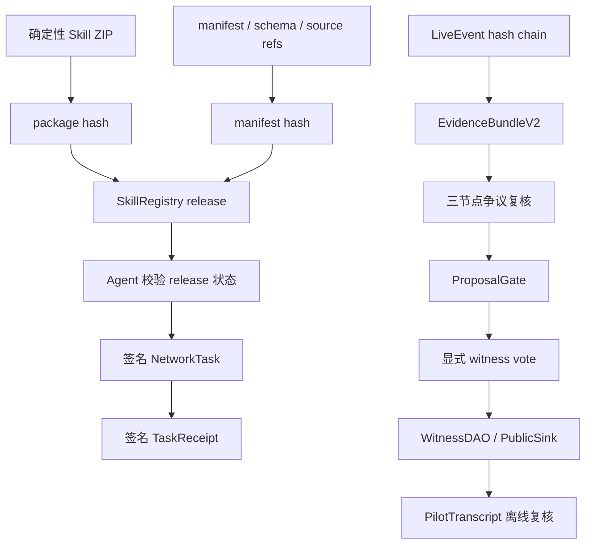
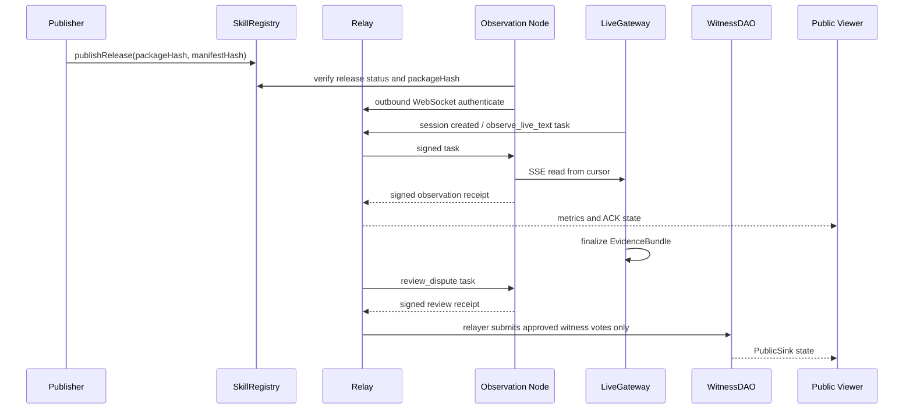

# LoveEngine Witness Skill 技术博客：把可验证见证做成可安装协议

状态：`current`
适用版本：`0.6.1-contract-public-pilot`

## 1. 问题定义

LoveEngine 当前不是中心化福利网站，也不是单纯的直播工具。它解决的是一个更小、
但更硬的问题：让外部人可以复核一次公共利益见证的来源、证据、节点回执、争议
复核、显式投票和链上执行。

因此系统的第一原则是：任何方便层都不能成为信任根。网页、Relay、Plugin
marketplace、README 和演示脚本都可以帮助参与，但最终必须能落到 package hash、
链上事实、签名绑定、EvidenceBundle 和 transcript。

## 2. 信任根



`SkillRegistry` 是辅助合约，不属于四个 UAS 业务合约。它记录 publisher、
skillId、versionHash、packageHash、manifestHash、版本状态和替代版本。包可以
来自 GitHub Release、Relay、S3、IPFS 或本地镜像，但节点只信链上的 hash。

## 3. Skill 与 Plugin 的边界

Codex 官方文档把 Skill 定义为可复用工作流的作者格式：`SKILL.md` 携带指令、
资源和可选脚本，Codex 只在需要时加载完整内容。Plugin 是可安装分发单元，可以
打包 Skill、App 集成和 MCP server。

LoveEngine 因此采用“薄 Skill、厚运行时”：

- `skills/loveengine-witness/SKILL.md` 只放触发条件、验证路径和安全边界；
- 复杂协议放在 Python 包、JSON Schema、manifest、合约、fixtures 和
  transcript；
- `plugins/loveengine-witness/` 只是 Codex 分发入口；
- 协议信任仍由 SkillRegistry packageHash 决定。

这避免了把长业务逻辑塞进 Agent prompt，也避免把 plugin 安装误解为安全证明。

## 4. 后端选型

| 组件 | 选择 | 原因 |
| --- | --- | --- |
| Python | Python 3.11 + `uv` | 当前团队可维护；锁文件可复现；CLI、测试和服务可共用模型。 |
| HTTP / SSE / WS | `aiohttp` | 单进程内组合 LiveGateway、Relay Hub、dashboard、operator UI、health 和 metrics。 |
| 本地状态 | SQLite | M6 目标是单机/Tailscale 试点；SQLite 提供可备份、可恢复、低运维成本的持久化。 |
| Schema | JSON Schema Draft 2020-12 | 对 manifest、invite、task、receipt、bundle 和 transcript 做机器可读合约。 |
| Hash | canonical JSON + SHA-256 / Keccak-256 | 文件和包用 SHA-256；链上 payload/evidence 用 canonical JSON 的 Keccak-256。 |

这套选择不是为了最大吞吐，而是为了“可复现、可检查、可迁移”。M6 的规模是
1 台服务器、3 个 Agent、10 个只读观察者、单场最长 4 小时。

## 5. 合约选型

合约使用 Foundry `1.7.1`、Solidity `0.8.26` 和 OpenZeppelin `EIP712/ECDSA`。
四个核心业务合约仍是：

- `WitnessDAO`
- `CorporateSink`
- `StreamingEngine`
- `PublicSink`

M6 融合 contract-team v2 的业务表达，但保留当前协议的安全底线：投票签名绑定
proposalId、payloadHash、reasonHash、nonce 和 deadline；治理参数可配置；失败
提案可 finalize；`PublicSink` 保持只读。

`docs/reference/contracts/contract-team-v2/` 是 preserved reference input。融合决策
记录在 `docs/development/contract2-comparison-and-recommendations.md`，不是直接把
reference copy 改成 target ABI。

## 6. Agent 网络



节点只主动出站连接 Relay，不要求公网 IP。Relay 使用 at-least-once delivery，节点
通过 taskId、issuer nonce 和 durable cursor 去重。Relay 可以延迟或丢弃消息，
但不能伪造有效任务或回执。

M6 仍不实现 P2P、HA、端到端加密或生产身份系统。这些会显著增加复杂度，和当前
“小规模真实试点”目标不匹配。

## 7. 证据链

直播文字被拆成 `LiveEvent`：

- sequence 连续；
- `previousEventHash` 形成 hash chain；
- 原始文字写入 content-addressed artifact；
- close 后生成 `EvidenceBundleV2`；
- critical dispute 需要三个不同节点复核；
- ProposalGate 只在争议 dismissed 后输出只读 proposal plan。

原始证据不上链。链上只保存必要 hash 和执行状态。这样保留公开可复核性，同时不
把文本、附件或个人信息永久写入链。

## 8. 安全边界

- Agent 不接触私钥、助记词或 keystore。
- Agent 不自动投票。
- 投票见证者必须显式执行 `loveengine witness vote approve`。
- Pilot write token 只从受限文件读取，不进入 URL、日志、fixture 或 transcript。
- Relayer 只能提交签名，不能替见证者签名。
- package、manifest、task、receipt、bundle 和 transcript 都能离线复核。

## 9. 当前限制

Implemented：

- 本地合约、SkillRegistry、Relay、LiveGateway、三节点观察、争议复核、显式投票、
  package/install、自检、snapshot、soak 和 UI fixture。

Active：

- M6 contract fusion review、参与者上手、截图手册、Plugin 分发、Tailscale/Debian
  试点和公网/测试网预备。

Deferred：

- 生产 TLS/HA、P2P、端到端加密、真实直播平台 SDK、多模态视频分析、生产身份系统、
  公共测试网默认部署和 M7 企业补偿产品面。

## 10. 可复现实验命令

```powershell
uv sync --frozen
uv run python .\tools\check.py
uv run pytest -m "not integration" -q
```

```powershell
uv run loveengine package build --output .\dist
uv run loveengine package verify .\dist\loveengine-witness-0.6.1-contract-public-pilot.zip --expected-package-hash <registry-keccak>
```

```powershell
uv run loveengine pilot quickstart --root .\pilot --headless
uv run loveengine pilot status --url http://127.0.0.1:8780
```

```powershell
uv run loveengine demo lan-pilot --output .\pilot-output
uv run loveengine pilot transcript verify .\pilot-output\pilot.fixture.json
```

合约测试：

```powershell
cd contracts
forge test
cd ..
```

contract-team v2 reference 编译：

```powershell
cd contracts
forge build --contracts ..\docs\reference\contracts\contract-team-v2\contracts
cd ..
```

## 11. 参考

- Codex Skills: <https://developers.openai.com/codex/skills>
- Codex Plugins: <https://developers.openai.com/codex/plugins>
