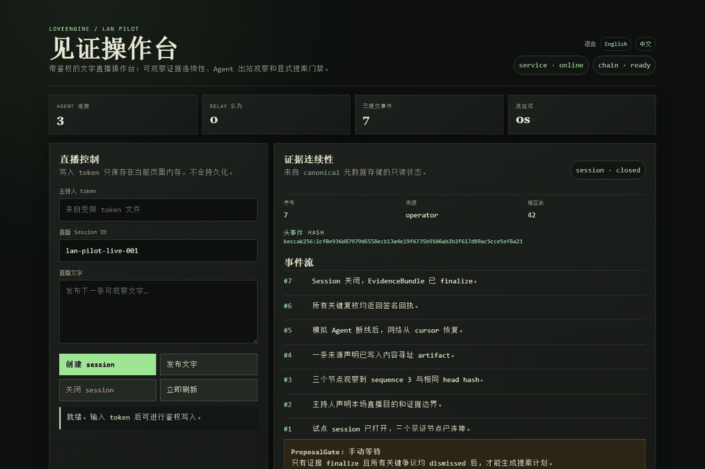
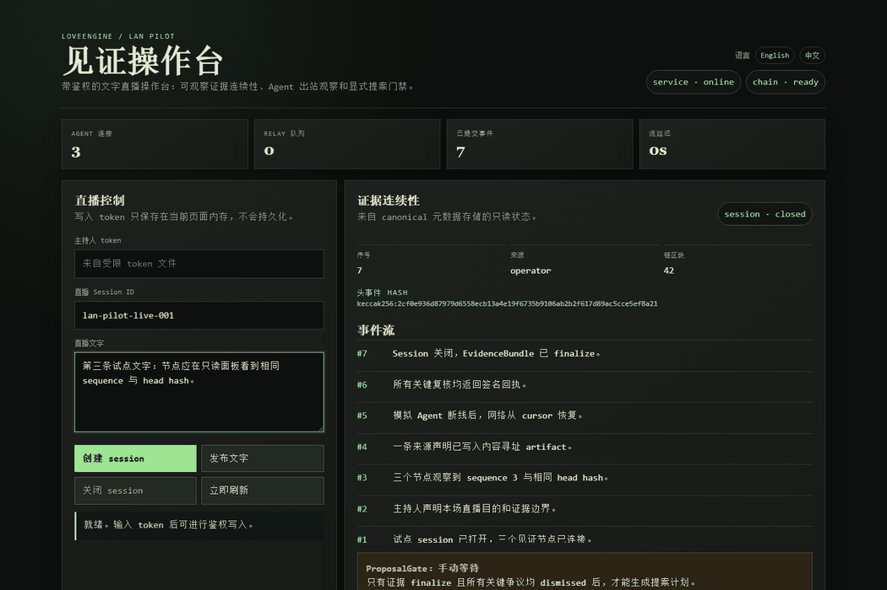
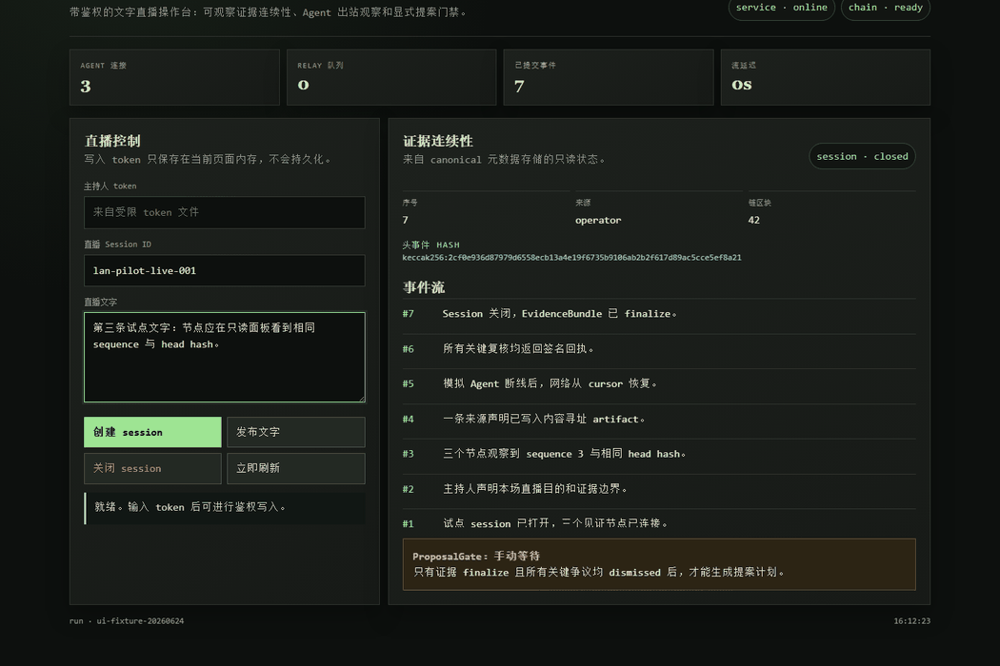

# 主持人操作流程

适用角色：主持人 / Operator  
适用版本：`0.6.0-contract-public-pilot`

主持人负责启动 Pilot Server、创建文字直播 session、发布文字、关闭
session，并查看证据连续性和 ProposalGate 状态。主持人不持有投票私钥。

## 1. 启动本地试点

```powershell
uv sync --frozen
uv run loveengine pilot quickstart --root .\pilot --open-ui
```

`quickstart` 是长运行命令。保持该终端打开。另开一个终端检查状态：

```powershell
uv run loveengine pilot status --url http://127.0.0.1:8780
```

无图形界面时使用：

```powershell
uv run loveengine pilot quickstart --root .\pilot --headless
```

命令输出 JSON，其中：

- `operator_url` 是主持人页面；
- `dashboard_url` 是只读页面；
- `invite_path` 发给观察节点；
- `token_file` 是本机受限 token 文件。

不要把 token 复制到聊天、README、fixture、日志或 transcript。

## 2. 打开主持人页面

中文页面：

```text
http://127.0.0.1:8780/operator/?lang=zh-CN
```



页面顶部显示服务、链、Agent 连接数、Relay 队列、已提交事件和流延迟。
如果 `service` 或 `chain` 不是绿色，先不要发布事件。

## 3. 输入 token 并创建 session

从 `token_file` 读取 token，粘贴到页面的“主持人 token”输入框。token 只保存在
当前页面内存，不进入 URL 或 localStorage。

检查 `直播 Session ID`，然后点击“创建 session”。



如果返回 `write_auth_required`，说明 token 错误或没有输入。重新读取
`token_file`，不要把 token 写进命令行参数。

## 4. 发布文字事件

在“直播文字”中输入下一条可观察文字，点击“发布文字”。M6 文字事件会写入
本地 SQLite、artifact store 和事件 hash chain。


正常结果：

- `已提交事件` 增加；
- `序号` 增加；
- `头事件 hash` 改变；
- 右侧事件流出现新内容。

重复完全相同事件会幂等处理；同 ID 不同内容会被拒绝。

## 5. 关闭 session 并检查 Gate

确认文字发布完成后点击“关闭 session”。关闭后不能再写入该 session，只能生成
新的 revision 或新的 session。



ProposalGate 只有在以下条件同时满足时才放行：

1. session 已关闭；
2. EvidenceBundle 已 finalize；
3. 所有 critical dispute 都是 `dismissed`；
4. bundle hash 与 proposal plan 匹配。

Gate 放行后主持人仍不签投票，只生成 proposal plan 给投票见证者核对。

## 6. 用只读面板交叉检查

打开：

```text
http://127.0.0.1:8780/demo/?lang=zh-CN
```

只读面板中的 session、事件数量和 head hash 应与主持人页面一致。只读面板没有
写入按钮，不需要 token。

## 7. 停止

开发机上按 `Ctrl+C` 停止 `quickstart`。正式试点应使用 systemd 或后续
Tailscale/Debian runbook 管理进程。
