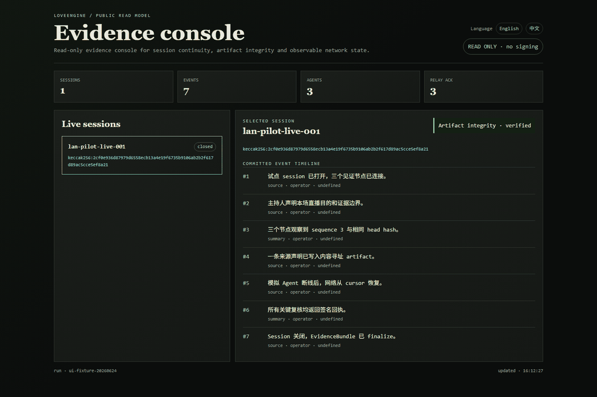

# 发布者流程

适用角色：发布者 / Publisher  
适用版本：`0.6.0-contract-public-pilot`

发布者负责构建确定性 ZIP，发布 SkillRegistry release，并维护版本状态。Plugin
或 marketplace 只是分发入口；协议信任根仍是 SkillRegistry 上的 package hash。

## 1. 构建确定性 ZIP

```powershell
uv sync --frozen
uv run loveengine package build --output .\dist
```

构建器会固定路径顺序、时间戳、权限和分隔符，并拒绝：

- 绝对路径；
- 路径穿越；
- 符号链接；
- `.venv`、缓存、日志、token、私钥、keystore 等秘密文件。

## 2. 校验 ZIP

```powershell
uv run loveengine package verify .\dist\loveengine-witness-0.6.0-contract-public-pilot.zip
```

预期输出包含 ZIP 的 `keccak256`、checksums 和 SBOM 结果。相同提交重复构建应得
到相同 archive hash。

## 3. 安装到全新目录自检

```powershell
uv run loveengine package install `
  .\dist\loveengine-witness-0.6.0-contract-public-pilot.zip `
  --target .\install-smoke

uv run loveengine package self-check --root .\install-smoke
```

全新目录不能跳过 self-check。缺文件、checksum 错误或秘密文件都会失败。

## 4. 发布 Registry release

```powershell
uv run loveengine registry publish --input .\release-plan.json
uv run loveengine registry verify --input .\release-plan.json
```

release plan 必须绑定：

- publisher；
- skillId；
- versionHash；
- packageHash；
- manifestHash；
- previousVersionHash；
- status。

节点从 Relay 或其他镜像下载包，但必须用链上 packageHash 校验。

## 5. 分发 Plugin 或 invite

Codex 用户可通过 Plugin 发现工作流；非 Codex 或 headless 节点可使用 ZIP。两条
路径都不能取代 Registry 校验。

英文概览页面：




## 6. 撤销或替换

如果版本有问题，发布者应在 SkillRegistry 中把 release 标为 deprecated 或
revoked，并指向 replacementVersionHash。revoked 版本不能重新激活。
