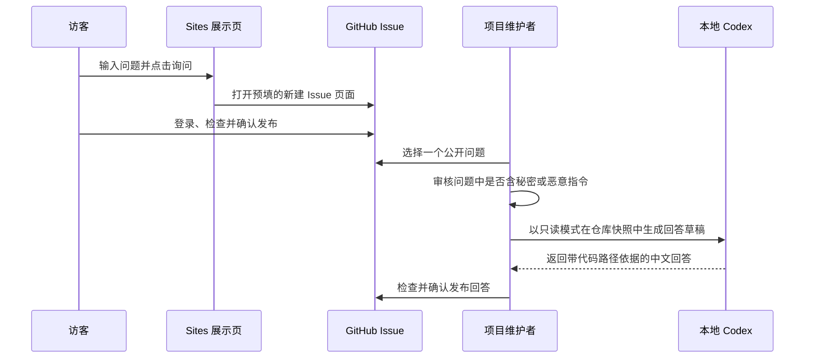

# 展示页问题入口与本地 Codex 回答流程

状态：实验性协作入口

## 目的

公开展示页允许访客输入问题。点击“询问”后，浏览器打开 GitHub 的新建 Issue
页面并预填问题；访客登录 GitHub、检查内容并确认发布后，项目维护者即可收到问题。

Sites 不直接连接维护者电脑，也不能直接启动本机 Codex。GitHub Issue 是公开、可审计
且需要访客确认的中间通道。



## 本机操作

先预览回答，不向 GitHub 写入：

```powershell
uv run python .\tools\answer_showcase_question.py <issue-number> --reviewed
```

确认草稿后再发布；命令会再次要求人工确认：

```powershell
uv run python .\tools\answer_showcase_question.py <issue-number> --reviewed --post
```

## 安全边界

- Issue 内容是不可信输入，不会作为 Shell 命令执行。
- 维护者必须先检查 Issue，再显式传入 `--reviewed`；脚本不会自动消费所有公开问题。
- Codex 的工作目录来自临时 `git archive` 快照；快照只包含指定提交中已跟踪的文件，
  不包含工作树中的 `.env`、token、私钥或临时文件。
- Codex 使用 `--sandbox read-only`、`approval_policy=never`、`--ephemeral`，
  显式关闭网页搜索并清空工具命令继承的环境变量；这些设置限制写入和网络能力，
  但不应被视为针对恶意提示的完整主机隔离。
- 回答提示要求只陈述仓库可证明的事实，并区分实现、实验和未验证能力。
- 默认命令只生成本地草稿，不自动评论、不关闭 Issue，也不修改仓库。
- 发布回答必须由维护者显式使用 `--post` 并确认。
- 如需无人值守处理公众输入，应在不含其他资料和凭据的独立操作系统账户、虚拟机或容器中运行；
  当前脚本有意不提供无人值守发布开关。
- 该入口不是匿名实时聊天、常驻任务队列或生产客服系统。

## 失败与恢复

GitHub 登录、Issue 创建、`gh` 认证或 Codex 运行失败时，问题和回答不会被静默丢弃：
Issue 保留在 GitHub，本地草稿保留在忽略目录 `tmp/showcase-questions/`。维护者可在修复
环境后对同一 Issue 重试。脚本会拒绝重复发布相同提交生成的回答标记。
